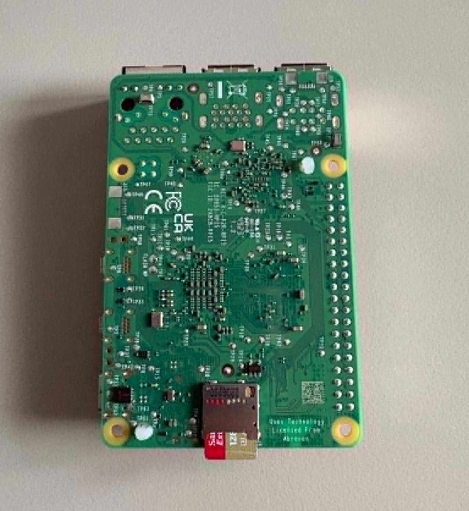
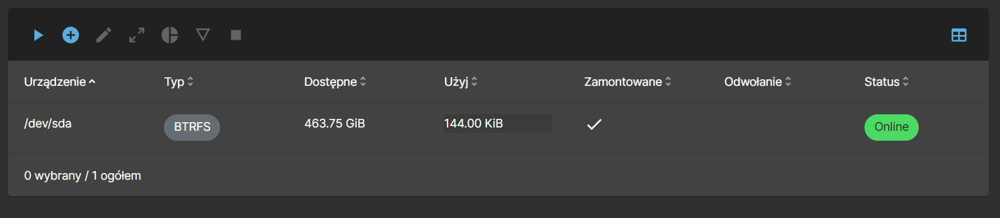
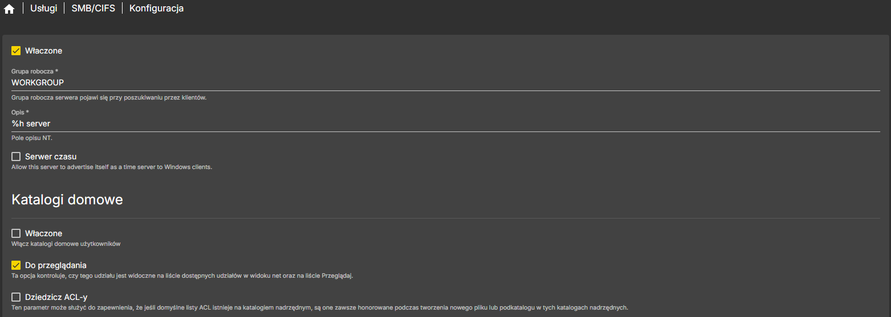
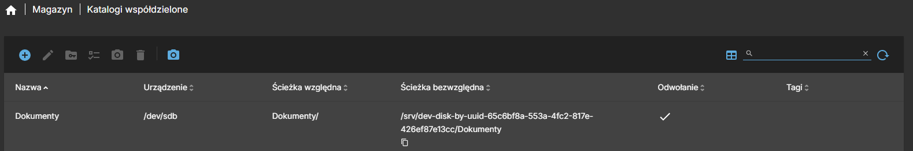
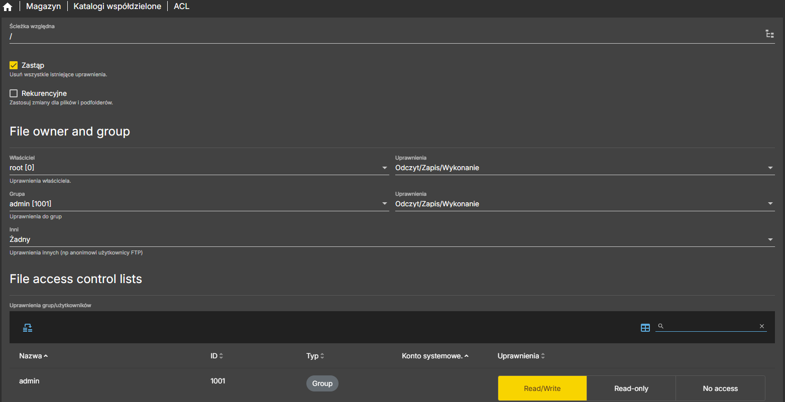
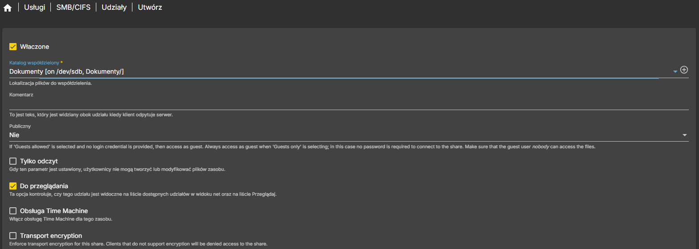
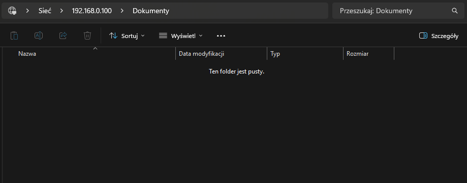

# Konfiguracja OpenMediaVault, dysków i udziału SMB

W pierwszym etapie projektu przygotowałem **Raspberry Pi 5** jako bazę pod domowy NAS.

Zainstalowałem **OpenMediaVault**, skonfigurowałem dyski, przygotowałem RAID 1 i utworzyłem pierwszy udział SMB dostępny z poziomu Windowsa.

Docelowo Raspberry Pi ma działać jako mały, energooszczędny serwer plików oraz baza pod kolejne usługi self-hosted. Nie buduję tutaj rozwiązania klasy enterprise ani pełnego zamiennika dla TrueNAS Scale. Chcę mieć lekkie środowisko, które mogę realnie wykorzystywać w domu i rozwijać krok po kroku.

Na tym etapie zależało mi przede wszystkim na jednej rzeczy: centralnym miejscu w sieci lokalnej, do którego mogę wrzucać pliki z komputera i mieć do nich dostęp z innych urządzeń.

Raspberry Pi 5 dobrze sprawdza się w takim scenariuszu. Jest małe, pobiera mało prądu, ma dobre wsparcie społeczności i pozwala uruchomić nie tylko NAS, ale też Dockera oraz kolejne usługi kontenerowe.

W tym etapie przygotowałem:

- Raspberry Pi 5,
- OpenMediaVault,
- dwa dyski jako magazyn danych,
- BTRFS / RAID 1,
- katalogi współdzielone,
- użytkowników i uprawnienia,
- udział SMB dostępny z Windowsa.

# Co wykorzystałem

## Raspberry Pi 5
Jako główną platformę wybrałem **Raspberry Pi 5**.


To urządzenie będzie pełnić rolę małego serwera domowego. Na początku obsługuje magazyn plików, a w kolejnych etapach dojdą usługi kontenerowe, takie jak Nextcloud, AdGuard Home, Vaultwarden, Grafana i Uptime Kuma.

## Nośnik systemowy
System uruchomiłem z karty microSD. Obraz przygotowałem w Raspberry Pi Imagerze dostępnym na oficjalnej stronie producenta, korzystając z Raspberry Pi OS Lite 64-bit.  
  
Wybrałem wersję Lite, ponieważ nie potrzebuję środowiska graficznego. Raspberry Pi ma działać jako serwer, więc wystarczy lekki system bazowy dostępny przez SSH.



Na nim działa system bazowy oraz OpenMediaVault. Dane użytkownika trzymam osobno, na dyskach podłączonych jako magazyn danych.

## Dyski na dane
Do części NAS wykorzystałem dwa dyski SSD firmy Crucial o łącznej pojemności 500GB. Do ich podłączenia do RaspberyPI konieczne było dokupienie dwóch adapterów USB do SATA.

Skonfigurowałem je w **RAID 1**, czyli w układzie, w którym dane są zapisywane na obu dyskach. Dzięki temu awaria jednego nośnika nie oznacza od razu utraty plików.

## Sieć
Raspberry Pi podłączyłem przewodowo przez Ethernet.

Przy NAS-ie stabilność sieci ma większe znaczenie niż wygoda. Wi-Fi może działać, ale przy przesyłaniu większych plików przewód jest lepszym wyborem.

# Krok 1: Aktualizacja systemu

Po pierwszym uruchomieniu Raspberry Pi połączyłem się z urządzeniem przez SSH i zaktualizowałem system.

```
sudo apt update
sudo apt upgrade
```

Po aktualizacji wykonałem restart:

```
sudo reboot
```

Po restarcie ponownie połączyłem się z Raspberry Pi przez SSH.

# Krok 2: Instalacja OpenMediaVault

Do zarządzania dyskami i udziałami sieciowymi wybrałem **OpenMediaVault**.

OMV daje wygodny panel webowy, w którym można zarządzać dyskami, systemami plików, użytkownikami, grupami, uprawnieniami oraz udziałami SMB.

Instalację wykonałem na podstawie skryptu z repozytorium:

```
https://github.com/OpenMediaVault-Plugin-Developers/installScript
```

Po zakończeniu instalacji panel OpenMediaVault był dostępny w przeglądarce pod adresem IP Raspberry Pi.

Przykład:

```
http://ADRES_IP_RASPBERRY_PI
```

Po pierwszym logowaniu zmieniłem domyślne hasło administratora.

# Krok 3: Podstawowa konfiguracja OpenMediaVault

Po wejściu do panelu OMV wykonałem podstawową konfigurację.

Zmieniłem hasło administratora, ustawiłem poprawną strefę czasową i sprawdziłem aktualizacje systemu z poziomu panelu.

Następnie zainstalowałem tylko te wtyczki, które były potrzebne na tym etapie:

- `openmediavault-flashmemory`,
- `openmediavault-omvextrasorg`,
- `openmediavault-compose`.

`openmediavault-flashmemory` ogranicza liczbę zapisów na pamięci flash. Część operacji trafia do RAM-u, a dopiero później na nośnik. Przy Raspberry Pi ma to sens, szczególnie jeśli system działa z karty microSD.

`openmediavault-omvextrasorg` dodaje dodatkowe możliwości, między innymi łatwiejszą instalację Dockera i Compose.

Ścieżka w panelu:

```
System → Plugins
```

Przygotowałem też certyfikat SSL dla panelu OMV. W środowisku lokalnym wystarczy certyfikat samopodpisany. Tak przygotowany certyfikat wyeksportowałem i zaimportowałem do głównego urzędu certyfikującego w systemie, dzięki czemu strona wyświetlała się już poprawnie.

Ścieżka w panelu:

```
System → Certyfikaty → SSL → Utwórz
```

Dodatkowo wymusiłem używanie SSL dla openmediavault włączając poniższą opcje i wskazując certyfikat.

```
System → Warsztat → SSL/TLS włączony
```


# Krok 4: Przygotowanie dysków

Po podstawowej konfiguracji przeszedłem do dysków.

W OpenMediaVault wybrałem:

```
Magazyn → Systemy plików → Utwórz
```

W projekcie użyłem:

- BTRFS,
- RAID 1,
- dwóch dysków jako magazynu danych.

Po utworzeniu systemu plików zapisałem i zamontowałem go w OMV.



## Krótko o RAID

RAID pozwala połączyć kilka dysków w jedną strukturę logiczną.

**RAID 0** zwiększa wydajność, ale nie daje odporności na awarię dysku.

**RAID 1** zapisuje te same dane na dwóch lub większej liczbie dysków. W tym projekcie wybrałem ten wariant, bo zależy mi na większej odporności magazynu danych.

**RAID 10** łączy mirroring i striping. Wymaga minimum czterech dysków.

W moim przypadku RAID 1 jest wystarczający. Projekt ma być prosty, czytelny i możliwy do utrzymania na małej platformie.

# Krok 5: Włączenie SMB/CIFS

Przed utworzeniem katalogu współdzielonego włączyłem usługę **SMB/CIFS** w OpenMediaVault.

W panelu przeszedłem do:

```
Usługi → SMB/CIFS → Konfiguracja
```

Włączyłem usługę SMB/CIFS i zostawiłem domyślną grupę roboczą:

```
WORKGROUP
```



Dzięki temu Raspberry Pi może udostępniać katalogi w sieci lokalnej w sposób widoczny dla komputerów z Windowsem.

W tej konfiguracji zaznaczyłem również opcję:

```
Do przeglądania
```

Ta opcja sprawia, że udział może być widoczny na liście dostępnych zasobów sieciowych.

Na tym etapie nie włączałem katalogów domowych użytkowników ani kosza dla katalogów domowych, ponieważ najpierw chciałem przygotować jeden konkretny udział sieciowy na dane.

Po zapisaniu ustawień zatwierdziłem zmiany w OpenMediaVault.

# Krok 6: Katalogi współdzielone

Po przygotowaniu systemu plików i włączeniu SMB/CIFS utworzyłem katalog współdzielony.



W OpenMediaVault przeszedłem do:

```
Magazyn → Katalogi współdzielone
```

Utworzyłem katalog

```
Dokumenty
```

Podczas tworzenia katalogu wskazałem system plików utworzony wcześniej na dyskach danych.

Ten katalog będzie widoczny w sieci jako udział SMB.

# Krok 7: Użytkownicy i grupy

Następnie utworzyłem użytkownika do dostępu do udziałów sieciowych.

W panelu OMV przeszedłem do:

```
Użytkownicy → Użytkownicy → Utwórz
```

Przygotowałem kilku użytkowników testowych i podzieliłem ich na dwie grupy: domownicy oraz admin.

Następnie z panelu użytkownicy przeszedłem do panelu Grupy.

```
Użytkownicy → Grupy → Utwórz
```

Utworzyłem dwie grupy 
- domownicy
- admin

Następnie wróciłem do katalogu współdzielonego i ustawiłem uprawnienia.

Ścieżka:

```
Magazyn → Katalogi współdzielone → Dokumenty → Lista kontroli dostępu
```

Dla grupy `admin` ustawiłem dostęp do odczytu i zapisu. Pozostali użytkownicy nie otrzymali dostępu do tego katalogu.



# Krok 8: Dodanie udziału SMB/CIFS

Usługa SMB/CIFS była już włączona, więc kolejnym krokiem było dodanie konkretnego udziału sieciowego.

W OpenMediaVault przeszedłem do:

```
Usługi → SMB/CIFS → Udziały
```

Dodałem nowy udział i wskazałem wcześniej utworzony katalog współdzielony.



Po zapisaniu zmian zatwierdziłem konfigurację w OMV.

OpenMediaVault często pokazuje żółty pasek z oczekującymi zmianami. Trzeba je zatwierdzić, inaczej konfiguracja nie zostanie zastosowana.

# Krok 9: Dostęp z Windowsa

Po skonfigurowaniu SMB udział był dostępny z poziomu Windowsa po adresie IP:

```
\\ADRES_IP_RASPBERRY_PI\Dokumenty
```

Windows poprosił o login i hasło. Użyłem danych użytkownika utworzonego wcześniej w OpenMediaVault.



Po zalogowaniu mogłem kopiować pliki do udziału sieciowego tak jak do zwykłego katalogu.

# Efekt po pierwszym etapie

Po tym etapie Raspberry Pi działa jako prosty domowy NAS.

Mam już:

- przygotowane Raspberry Pi,
- zainstalowany OpenMediaVault,
- skonfigurowane dyski,
- utworzony system plików,
- włączone SMB/CIFS,
- skonfigurowany katalog współdzielony,
- użytkowników i uprawnienia,
- działający udział SMB dostępny z komputera.

To jest baza pod kolejne etapy projektu.
