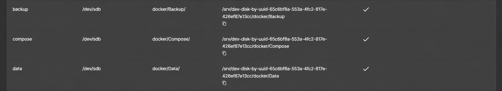
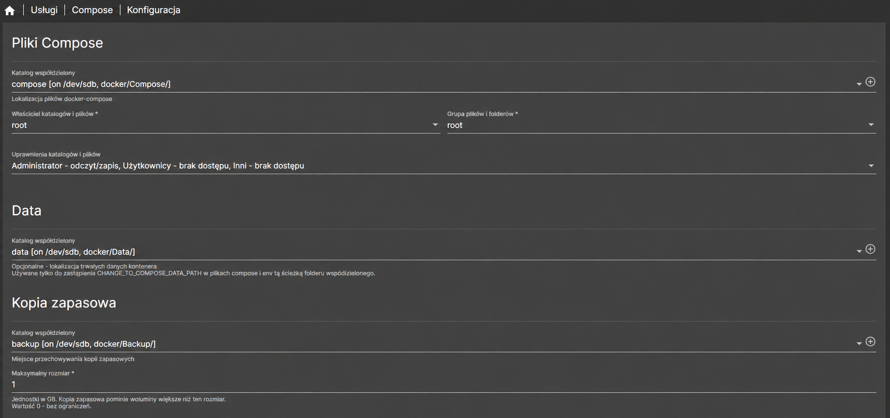
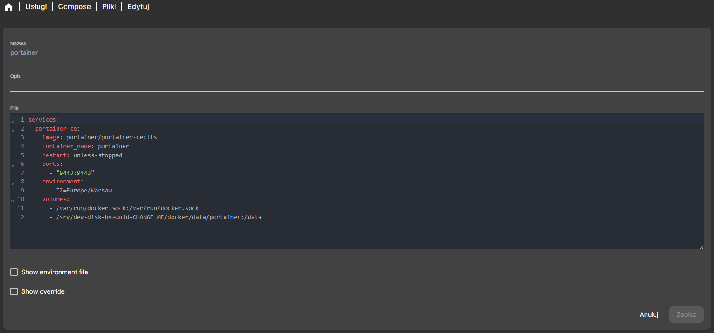
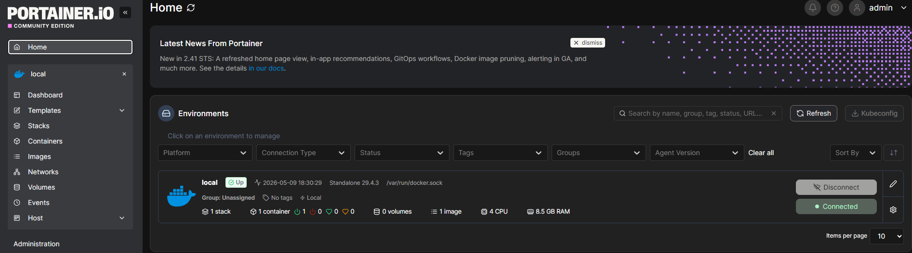

# Konfiguracja Dockera i Portainera  
  
W kolejnym etapie projektu przygotowałem środowisko pod usługi kontenerowe.  
  
Po skonfigurowaniu OpenMediaVault, dysków i udziału SMB przyszedł czas na **Dockera** oraz **Portainera**. Dzięki temu Raspberry Pi może działać nie tylko jako prosty NAS, ale też jako baza pod kolejne usługi self-hosted.  
  
Na tym etapie przygotowałem:  
- Docker,  
- Portainer,  
- strukturę katalogów dla kontenerów,  
- katalogi współdzielone dla plików Compose, danych i backupów,  
- podstawową konfigurację Compose w OpenMediaVault,  
- użytkownika technicznego dla usług kontenerowych.

## Dlaczego Docker?  
  
Docker pozwala uruchamiać aplikacje w kontenerach.  
  
Dzięki temu mogę łatwiej testować i utrzymywać kolejne usługi, takie jak:  
  
- Nextcloud,  
- AdGuard Home,  
- Nginx Proxy Manager,  
- Vaultwarden,  
- Grafana,  
- Uptime Kuma.

## Dlaczego Portainer?  
  
Do zarządzania kontenerami wybrałem **Portainera**.  
  
Portainer daje panel webowy, z którego można:  
  
- przeglądać kontenery,  
- uruchamiać i zatrzymywać usługi,  
- zarządzać stackami Docker Compose,  
- sprawdzać logi,  
- aktualizować konfigurację,  
- kontrolować wolumeny i sieci Dockera.  
  
W projekcie Portainer pełni rolę wygodnego panelu administracyjnego dla usług kontenerowych.

## Krok 1: Struktura katalogów dla Dockera

Na potrzeby usług kontenerowych przygotowałem osobną strukturę katalogów na dysku z danymi.

Docelowa struktura wygląda tak:

```
docker/
├── compose/
├── data/
└── backup/
```

Każdy katalog ma osobną rolę.

### compose

Katalog `compose` przechowuje pliki YAML dla usług uruchamianych przez Docker Compose.

Przykład:

```
docker/compose/portainer/portainer.yaml
```

### data

Katalog `data` przechowuje dane aplikacji uruchamianych w kontenerach.

Przykład:

```
docker/data/nextcloud/  
docker/data/adguardhome/  
docker/data/vaultwarden/  
docker/data/grafana/
```

### backup

Katalog `backup` będzie używany do przechowywania kopii konfiguracji i danych.

Na tym etapie przygotowałem tylko strukturę. Docelowa konfiguracja backupów będzie osobnym etapem projektu.

## Krok 2: Utworzenie katalogów na dysku

Same katalogi można utworzyć na kilka sposobów.

Można zrobić to przez:

- SSH,
- udział SMB,
- panel OpenMediaVault.

W moim przypadku najważniejsze było to, żeby katalogi fizycznie istniały na dysku z danymi, a później zostały dodane w OMV jako katalogi współdzielone.

Przykładowo z poziomu SSH można utworzyć je tak:

```
sudo mkdir -p /srv/dev-disk-by-uuid-CHANGE_ME/docker/compose
sudo mkdir -p /srv/dev-disk-by-uuid-CHANGE_ME/docker/data
sudo mkdir -p /srv/dev-disk-by-uuid-CHANGE_ME/docker/backup
```

W ścieżce:

```
/srv/dev-disk-by-uuid-CHANGE_ME/
```

trzeba podmienić `CHANGE_ME` na właściwy identyfikator dysku widoczny w OpenMediaVault.

Na tym etapie używam nazw małymi literami:

```
compose
data
backup
```

Dzięki temu ścieżki są spójne z Linuksem i późniejszymi plikami Compose.

## Krok 3: Dodanie katalogów jako katalogi współdzielone w OMV

Samo utworzenie katalogów przez SSH nie wystarcza, jeśli chcę wygodnie używać ich w panelu OpenMediaVault.

OpenMediaVault korzysta z własnej konfiguracji katalogów współdzielonych. Usługi i wtyczki OMV, takie jak SMB albo Compose, odwołują się do katalogów zarejestrowanych w panelu jako **Shared Folders**.

Dlatego po utworzeniu katalogów dodałem je w OMV jako osobne katalogi współdzielone.

W panelu przeszedłem do:

```
Magazyn → Katalogi współdzielone
```

Następnie dodałem:

```
compose → docker/compose/  
data → docker/data/  
backup → docker/backup/
```



Dzięki temu OMV widzi te lokalizacje w swojej konfiguracji i pozwala wybrać je później w ustawieniach Compose.

## Krok 4: Konfiguracja Compose w OpenMediaVault

Po utworzeniu katalogów współdzielonych skonfigurowałem Compose.

W panelu OMV przeszedłem do:

```
Usługi → Compose → Konfiguracja
```

Następnie wskazałem odpowiednie katalogi:

```
Katalog współdzielony dla plików Compose: compose  
Katalog współdzielony Shared folder dla danych aplikacji: data  
Katalog współdzielony Shared folder dla backupów: backup
```



Nazwy pól mogą się różnić zależnie od wersji wtyczki, ale sens jest ten sam:

- pliki Compose trafiają do `compose`,
- dane aplikacji trafiają do `data`,
- kopie zapasowe trafiają do `backup`.

Po zapisaniu ustawień zatwierdziłem zmiany w OpenMediaVault.

Od tego momentu OMV wie, gdzie przechowywać pliki Compose oraz dane kontenerów.

## Krok 5: Przygotowanie Portainera  
  
Po skonfigurowaniu Dockera i Compose przygotowałem pierwszy stack dla Portainera.  
  
Portainer będzie działał jako panel do zarządzania kontenerami.  
  
Właściwy plik Compose znajduje się tutaj:  
  
[Portainer compose.yaml](../docker/portainer/compose.yaml)  
  
W OpenMediaVault przeszedłem do:  
  
```
Usługi → Compose → Pliki
```



Następnie utworzyłem nowy plik Compose dla Portainera i wkleiłem zawartość pliku `docker/portainer/compose.yaml`.

W ścieżce:

```
/srv/dev-disk-by-uuid-CHANGE_ME/docker/data/portainer
```

trzeba podmienić `CHANGE_ME` na właściwy identyfikator dysku z OpenMediaVault.

Użyłem obrazu:

```
portainer/portainer-ce:lts
```

Zamiast `latest` wolę używać stabilniejszego tagu `lts`, ponieważ łatwiej kontrolować wersję i aktualizacje.

## Krok 6: Uruchomienie Portainera

Po zapisaniu pliku Compose uruchomiłem stack z poziomu OpenMediaVault.

W panelu OMV przeszedłem do:

```
Usługi → Compose → Pliki
```

Następnie wybrałem plik Portainera i uruchomiłem go przyciskiem startu.

Po chwili Portainer był dostępny w przeglądarce pod adresem:

```
https://ADRES_IP_RASPBERRY_PI:9443
```

Przy pierwszym wejściu Portainer poprosił o utworzenie konta administratora.

## Krok 7: Pierwsze logowanie do Portainera

Po wejściu na adres Portainera utworzyłem konto administratora.

Następnie wybrałem lokalne środowisko Dockera:

```
Local
```

Od tego momentu Portainer widzi lokalny Docker Engine działający na Raspberry Pi.



W panelu można sprawdzić:

- uruchomione kontenery,
- obrazy,
- wolumeny,
- sieci,
- stacki,
- logi kontenerów.

## Efekt po tym etapie

Po tym etapie Raspberry Pi ma przygotowaną bazę pod usługi kontenerowe.

Mam już:

- zainstalowanego Dockera,
- skonfigurowane OMV-Extras,
- zainstalowaną wtyczkę Compose,
- przygotowaną strukturę katalogów `docker/compose`, `docker/data` i `docker/backup`,
- dodane katalogi `compose`, `data` i `backup` jako katalogi współdzielone w OMV,
- skonfigurowane katalogi Compose w OpenMediaVault,
- uruchomionego Portainera,
- dostęp do panelu Portainera przez przeglądarkę,
