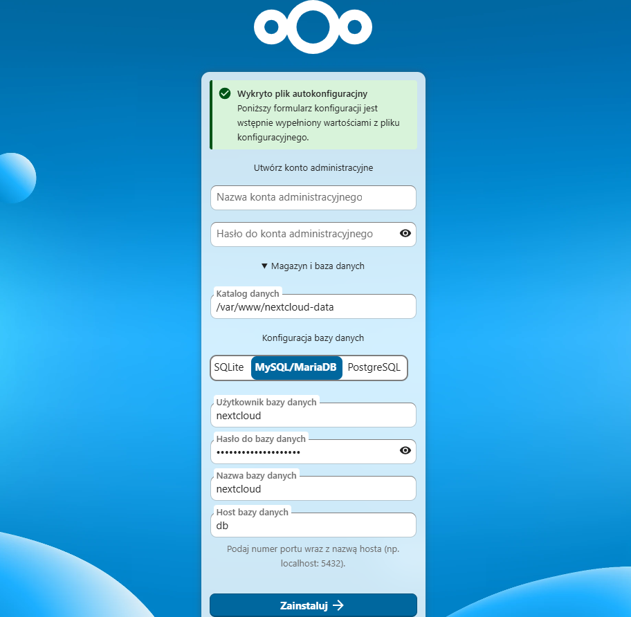
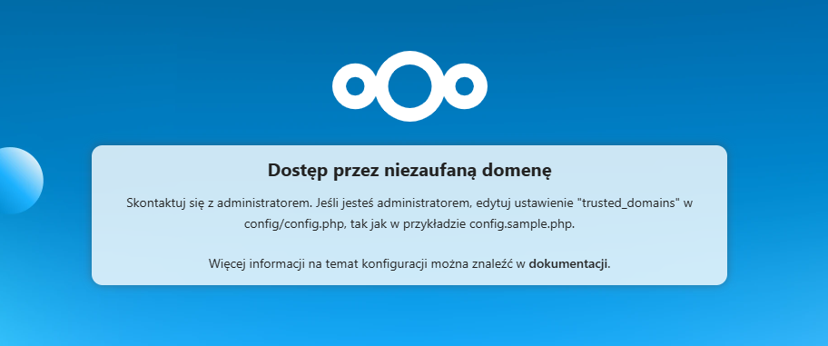
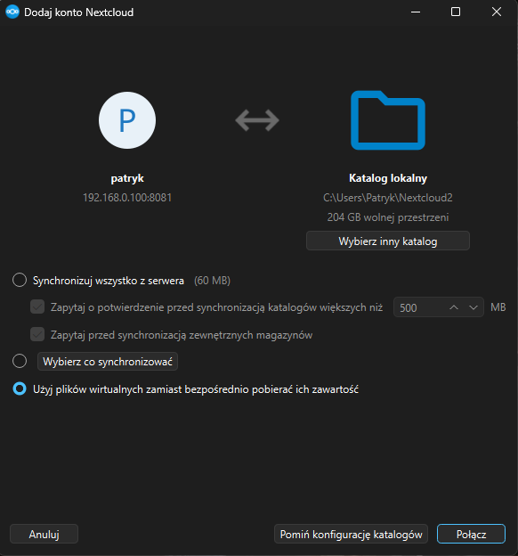
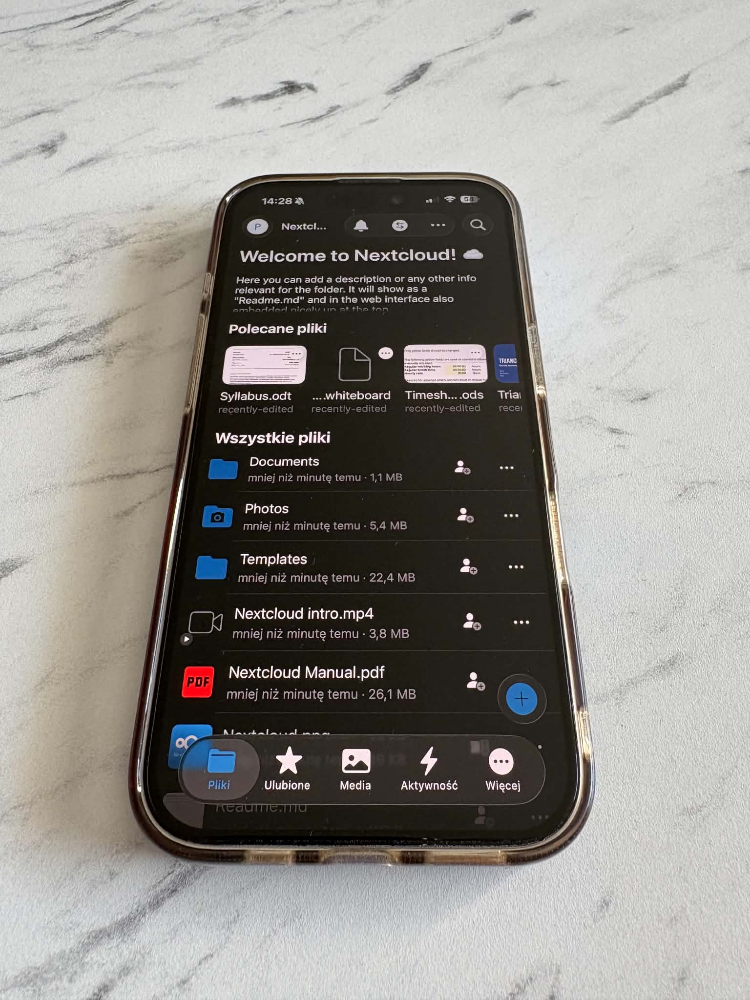

# Konfiguracja Nextcloud  
  
W kolejnym etapie projektu uruchomiłem **Nextcloud** jako prywatną chmurę plików.  
  
Po przygotowaniu OpenMediaVault, Dockera i Portainera mogłem przejść do jednej z głównych usług tego projektu. Nextcloud ma pełnić rolę lokalnej alternatywy dla rozwiązań takich jak Google Drive czy iCloud.  
  
Na tym etapie przygotowałem:  
  
- katalogi danych dla Nextcloud,  
- bazę danych MariaDB,  
- aplikację Nextcloud,  
- dodatkowy katalog na dane użytkowników,  
- podstawową konfigurację zaufanych domen,  
- dostęp lokalny do panelu Nextcloud,  
- przygotowanie pod późniejszy reverse proxy i dostęp przez Tailscale.

## Dlaczego Nextcloud?  
  
Nextcloud pozwala uruchomić prywatną chmurę plików na własnym sprzęcie.  
  
W tym projekcie będzie służyć do:  
  
- przechowywania dokumentów,  
- synchronizacji plików między urządzeniami,  
- dostępu do danych z komputera i telefonu,  
- testowania usług self-hosted,  
- nauki konfiguracji aplikacji webowych, baz danych i reverse proxy.  
  
Nie traktuję tej instalacji jako gotowego rozwiązania produkcyjnego. To część homelaba, która ma być praktyczna, ale jednocześnie edukacyjna.  
  
---  
  
## Założenia konfiguracji  
  
Nextcloud uruchamiam jako stack Docker Compose.  
  
W stacku znajdują się:  
  
- `app` — kontener z aplikacją Nextcloud,  
- `db` — baza danych MariaDB,  
  
Dane aplikacji trzymam na dysku podłączonym do OpenMediaVault, w strukturze katalogów Dockera.  
  
Przykładowa ścieżka:  
  
```
docker/data/nextcloud/
```

## Krok 1: Przygotowanie katalogów dla Nextcloud

Na potrzeby Nextcloud przygotowałem osobny katalog w strukturze danych Dockera.

Docelowa struktura wygląda tak:

```
docker/data/nextcloud/  
├── app/  
├── data/  
└── database/
```

Każdy katalog ma osobną rolę.

### app

Katalog `app` przechowuje pliki aplikacji Nextcloud.

### data

Katalog `data` przechowuje dane użytkowników Nextcloud, czyli pliki przesyłane do chmury.

### database

Katalog `database` przechowuje dane bazy MariaDB.

Przykładowe utworzenie katalogów przez SSH:

```
sudo mkdir -p /srv/dev-disk-by-uuid-CHANGE_ME/docker/data/nextcloud/app  
sudo mkdir -p /srv/dev-disk-by-uuid-CHANGE_ME/docker/data/nextcloud/data  
sudo mkdir -p /srv/dev-disk-by-uuid-CHANGE_ME/docker/data/nextcloud/database
```

W ścieżce:

```
/srv/dev-disk-by-uuid-CHANGE_ME/
```

trzeba podmienić `CHANGE_ME` na właściwy identyfikator dysku widoczny w OpenMediaVault.

## Krok 2: Dodanie stacka Nextcloud w Portainerze
Stack Nextcloud dodałem z poziomu Portainera.  
  
W Portainerze przeszedłem do:
```
Portainer → Stacks → Add stack
```

Następnie utworzyłem nowy stack o nazwie:

```
nextcloud
```

W polu edycji stacka wkleiłem zawartość pliku Compose przygotowanego dla Nextcloud.

Właściwy plik Compose znajduje się tutaj:

Nextcloud compose.yaml

W pliku Compose trzeba podmienić:

```
CHANGE_ME
```

na właściwy identyfikator dysku widoczny w OpenMediaVault.

## Krok 3: Dostęp do Nextcloud

Po uruchomieniu aplikacja była dostępna lokalnie pod adresem:

```
http://ADRES_IP_RASPBERRY_PI:8081
```

Przy pierwszym wejściu Nextcloud wyświetla kreator konfiguracji.



W kreatorze należy utworzyć konto administratora oraz upewnić się, że aplikacja korzysta z bazy MariaDB, a nie z SQLite.

W tym stacku dane bazy są przekazywane przez zmienne środowiskowe, dlatego Nextcloud powinien połączyć się z MariaDB automatycznie.

## Krok 4: Zaufane domeny

Nextcloud wymaga skonfigurowania zaufanych domen. W przeciwnym wypadku próbując połączyć sie z nim po nazwie domenowej wyskoczy taki komunikat.



Jeżeli aplikacja ma być dostępna pod nazwą:

```
lumiere.local:8081
```

trzeba dodać te adresy do konfiguracji Nextcloud.

Można to zrobić z poziomu kontenera:

```
sudo docker exec -it nextcloud-app-1 bash
```

Następnie:

```
su -s /bin/sh www-data -c "php occ config:system:set trusted_domains 2 --value=lumiere.local:8081"
```

Po zmianach restartuję kontener aplikacji:

```
sudo docker restart nextcloud-app-1
```

Dzięki temu Nextcloud nie będzie blokował wejścia po lokalnej nazwie hosta.

## Krok 5: Pierwszy test działania w przeglądarce

Po zakończeniu konfiguracji zalogowałem się do panelu Nextcloud utworzonym kontem administratora.

Następnie wykonałem podstawowy test działania:

- zalogowanie do panelu Nextcloud,
- utworzenie testowego katalogu,
- przesłanie przykładowego pliku,
- pobranie pliku z powrotem na komputer,
- sprawdzenie, czy plik jest nadal widoczny po odświeżeniu strony.
- Utworzenie dodatkowego użytkownika

## Krok 6: Test w aplikacji Nextcloud Desktop na Windowsie

Po sprawdzeniu działania w przeglądarce przetestowałem synchronizację z poziomu aplikacji **Nextcloud Desktop** na Windowsie.

Na komputerze zainstalowałem klienta Nextcloud Desktop, a następnie dodałem nowe konto.

Jako adres serwera podałem lokalny adres Nextcloud:

```
http://ADRES_IP_RASPBERRY_PI:8081
```

Po podaniu adresu aplikacja otworzyła stronę logowania Nextcloud w przeglądarce. Zalogowałem się utworzonym wcześniej kontem użytkownika i zatwierdziłem dostęp aplikacji desktopowej do konta.

Następnie wybrałem lokalny katalog na komputerze, który ma być synchronizowany z Nextcloud.



Po zakończeniu konfiguracji wykonałem test synchronizacji:

- utworzyłem testowy plik w lokalnym katalogu Nextcloud na Windowsie,
- poczekałem na zakończenie synchronizacji,
- sprawdziłem w panelu webowym Nextcloud, czy plik pojawił się w chmurze,
- dodałem drugi plik przez przeglądarkę,
- sprawdziłem, czy został pobrany przez aplikację desktopową na komputer.

Ten test potwierdził, że Nextcloud działa nie tylko przez panel webowy, ale również jako usługa synchronizacji plików z komputerem.

## Krok 7: Dostęp przez telefon

Po uruchomieniu Nextcloud można połączyć się z nim z aplikacji mobilnej.

W sieci lokalnej można użyć adresu:

```
http://ADRES_IP_RASPBERRY_PI:8081
```

Po pobraniu aplikacji, udało zalogować się na utworzonego testowo użytkownika.



## Troubleshooting: brak zapisu do katalogu danych Nextcloud
Podczas pierwszego uruchomienia Nextcloud pojawił się komunikat:
```
Nie można tworzyć ani zapisywać w katalogu /var/www/nextcloud-data
```

Problem wynikał z uprawnień do katalogu danych podmontowanego z hosta do kontenera.

Nextcloud działa w kontenerze jako użytkownik `www-data`, dlatego katalog danych musi być zapisywalny dla tego użytkownika.

Najpierw sprawdziłem, jaka ścieżka z hosta jest faktycznie podmontowana do kontenera:

```
sudo docker inspect nextcloud-app-1 --format '{{ range .Mounts }}{{ .Source }} -> {{ .Destination }}{{ println }}{{ end }}'
```

Wynik pokazał między innymi:

```
/srv/dev-disk-by-uuid-CHANGE_ME/docker/data/NextCloud/app  -> /var/www/html
/srv/dev-disk-by-uuid-CHANGE_ME/docker/data/NextCloud/data -> /var/www/nextcloud-data
```

To ważne, ponieważ wcześniej sprawdzałem uprawnienia na innej ścieżce. Kontener korzystał z katalogu:

```
/srv/dev-disk-by-uuid-CHANGE_ME/docker/data/NextCloud/data
```

a nie z katalogu bezpośrednio pod `/data/NextCloud/data`.

Po ustaleniu właściwej ścieżki nadałem odpowiedniego właściciela katalogom `app` i `data`:

```
sudo chown -R 33:33 /srv/dev-disk-by-uuid-CHANGE_ME/docker/data/NextCloud/app
sudo chown -R 33:33 /srv/dev-disk-by-uuid-CHANGE_ME/docker/data/NextCloud/data

sudo chmod -R 755 /srv/dev-disk-by-uuid-CHANGE_ME/docker/data/NextCloud/app
sudo chmod -R 755 /srv/dev-disk-by-uuid-CHANGE_ME/docker/data/NextCloud/data
```

UID/GID `33:33` odpowiada użytkownikowi `www-data`, którego używa kontener Nextcloud.

Po zmianie uprawnień zrestartowałem kontener:

```
sudo docker restart nextcloud-app-1
```

Następnie sprawdziłem uprawnienia wewnątrz kontenera:

```
sudo docker exec -it nextcloud-app-1 ls -ld /var/www/nextcloud-data
```

Katalog powinien być widoczny jako należący do `www-data`.

Po tej zmianie instalator Nextcloud przeszedł dalej poprawnie.

## Podsumowanie

Nextcloud jest pierwszą dużą usługą self-hosted w tym projekcie.

Dzięki Dockerowi mogłem uruchomić go jako osobny stack, z własną bazą danych i własnym katalogiem danych. OpenMediaVault nadal odpowiada za dyski i magazyn danych, a Docker pozwala uruchamiać aplikację w bardziej uporządkowany sposób.

Ten etap zamienia Raspberry Pi z prostego NAS-a w prywatną chmurę plików, którą można dalej integrować z VPN, reverse proxy i monitoringiem.
