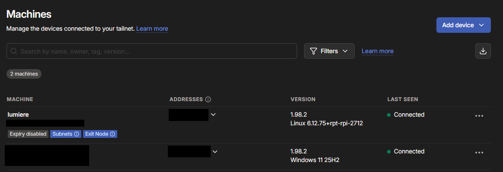
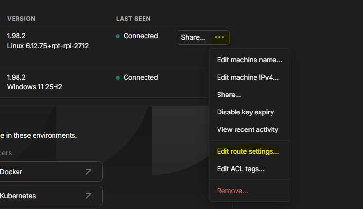
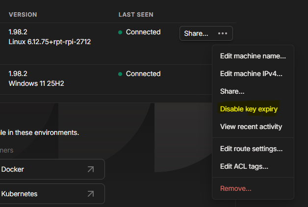

# Konfiguracja Tailscale VPN

W kolejnym etapie projektu skonfigurowałem **Tailscale** jako prywatny dostęp zdalny do środowiska homelabowego.  
  
Po uruchomieniu podstawowych usług na Raspberry Pi zależało mi na tym, żeby móc korzystać z nich również poza siecią domową, ale bez wystawiania ich bezpośrednio do internetu.  
  
Tailscale pozwala utworzyć prywatną sieć VPN opartą o WireGuard, dzięki której mogę łączyć się z Raspberry Pi i usługami self-hosted z zaufanych urządzeń.  
  
Na tym etapie przygotowałem:  
  
- konto Tailscale,
- komputer z Windowsem dodany do tailneta,
- Raspberry Pi dodane do tailneta,
- prywatny adres Tailscale dla Raspberry Pi,
- dostęp SSH przez Tailscale,
- dostęp do usług przez lokalny adres IP dzięki subnet routerowi,
- bezpieczny zdalny dostęp do Nextcloud, Portainera i pozostałych usług.

## Dlaczego Tailscale?  
  
Nie chciałem wystawiać usług takich jak Nextcloud, Portainer czy OpenMediaVault bezpośrednio do internetu.  
  
Tailscale pozwala uzyskać dostęp zdalny bez:  
  
- przekierowywania portów na routerze,  
- wystawiania paneli administracyjnych publicznie,  
- konfiguracji klasycznego VPN-a od zera,  
- posiadania publicznego adresu IP.  
  
Dzięki temu mogę połączyć się z Raspberry Pi z laptopa albo telefonu, ale usługi nadal pozostają prywatne.  

## Krok 1: Utworzenie konta Tailscale i dodanie komputera  
  
Pierwszym krokiem było utworzenie konta na stronie Tailscale.  
  
Po założeniu konta dodałem do sieci Tailscale swój komputer z systemem Windows. Było to potrzebne, żeby mieć pierwsze urządzenie w prywatnej sieci i później przetestować połączenie z Raspberry Pi.  
  
Na komputerze z Windowsem pobrałem i zainstalowałem aplikację Tailscale.  
  
Po instalacji zalogowałem się w aplikacji tym samym kontem, które utworzyłem na stronie Tailscale. Dzięki temu komputer został sparowany z moją prywatną siecią Tailscale, czyli tailnetem.  
  
Po dodaniu komputera mogłem sprawdzić go w panelu administracyjnym Tailscale w sekcji **"Machines"** 
  


Na tym etapie w tailnecie znajdował się już komputer z Windowsem, a kolejnym krokiem było dodanie Raspberry Pi.

## Krok 2: Instalacja Tailscale na Raspberry Pi
  
Instalację Tailscale wykonałem na Raspberry Pi zgodnie z instrukcją dla Raspberry Pi OS / Debian.  

```
https://tailscale.com/docs/install/rpi/rpi-bookworm
```
  
Na Raspberry Pi uruchomiłem instalację Tailscale, a następnie dodałem urządzenie do mojego konta Tailscale.  

W nowszych wersjach Raspberry Pi OS / Debian komenda `apt-key` może być niedostępna. W takim przypadku zamiast starszej metody z `apt-key` można użyć metody z keyringiem.

Przykładowa instalacja:

```
curl -fsSL https://pkgs.tailscale.com/stable/raspbian/bookworm.noarmor.gpg | sudo tee /usr/share/keyrings/tailscale-archive-keyring.gpg >/dev/null

curl -fsSL https://pkgs.tailscale.com/stable/raspbian/bookworm.tailscale-keyring.list | sudo tee /etc/apt/sources.list.d/tailscale.list

sudo apt update
sudo apt install tailscale -y
```
  
Po instalacji uruchomiłem:  
  
```
sudo tailscale up
```

Po wykonaniu komendy Tailscale wyświetlił link logowania. Po otwarciu linku w przeglądarce zatwierdziłem dodanie Raspberry Pi do prywatnej sieci.

## Krok 3: Dostęp do Raspberry Pi przez Tailscale
Po dodaniu komputera z Windowsem i Raspberry Pi do tej samej sieci Tailscale mogłem przetestować połączenie między urządzeniami. Najpierw sprawdziłem adres IP Tailscale przypisany do Raspberry Pi:
```
tailscale ip -4
```

Adres Tailscale znajduje się zwykle w zakresie:

```
100.x.x.x
```

Następnie z komputera z Windowsem mogłem połączyć się z Raspberry Pi po SSH, używając adresu Tailscale:

```
ssh NAZWA_UZYTKOWNIKA@ADRES_TAILSCALE_RASPBERRY_PI
```

Przykład:

```
ssh patryk@100.x.x.x
```

Dzięki temu połączenie SSH działa przez prywatną sieć Tailscale, bez konieczności przebywania w tej samej sieci lokalnej.

## Krok 4: Konfiguracja subnet routera i dostęp do usług przez Tailscale  
  
Po dodaniu komputera z Windowsem i Raspberry Pi do tej samej sieci Tailscale mogłem połączyć się bezpośrednio z samym Raspberry Pi po jego adresie Tailscale.

Jeżeli jednak chcę korzystać z usług działających w sieci lokalnej tak, jakbym był w domu, potrzebna jest konfiguracja Raspberry Pi jako **subnet router**.

Subnet router pozwala urządzeniom połączonym z Tailscale uzyskać dostęp do całej sieci lokalnej, np.:

```
192.168.0.0/24
```

Dzięki temu komputer połączony przez Tailscale może wejść na usługi działające lokalnie na Raspberry Pi, np.:

```
http://192.168.0.100:8081
```

dla Nextcloud albo:

```
https://192.168.0.100:9443
```

dla Portainera.

### Włączenie subnet routera na Raspberry Pi

Na Raspberry Pi uruchomiłem:

```
sudo tailscale up --advertise-routes=192.168.0.0/24
```

Wartość:

```
192.168.0.0/24
```

trzeba dopasować do własnej sieci lokalnej.

Jeżeli sieć domowa działa np. jako:

```
192.168.1.0/24
```

to komenda powinna wyglądać tak:

```
sudo tailscale up --advertise-routes=192.168.1.0/24
```

### Zatwierdzenie trasy w panelu Tailscale

Samo uruchomienie komendy z `--advertise-routes` na Raspberry Pi nie wystarczy.

Po stronie panelu Tailscale trzeba jeszcze zatwierdzić trasę.

W panelu administracyjnym Tailscale przeszedłem do:

```
Machines
```

Następnie wybrałem Raspberry Pi i odszukałem sekcję z reklamowanymi trasami.

Tam zatwierdziłem trasę:

```
192.168.0.0/24
```



Po zatwierdzeniu trasy Raspberry Pi zaczęło działać jako brama do sieci lokalnej dla urządzeń połączonych przez Tailscale.

## Krok 5: Test dostępu spoza sieci lokalnej  
  
Po skonfigurowaniu subnet routera wykonałem test spoza sieci lokalnej, łącząc sie z siecią udostępnioną z telefonu.  
  
Na komputerze z Windowsem uruchomiłem aplikację Tailscale i upewniłem się, że urządzenie jest połączone z tailnetem.  
  
Następnie sprawdziłem:  
  
- połączenie SSH z Raspberry Pi,  
- dostęp do Nextcloud po lokalnym adresie `192.168.0.100:8081`,  
- dostęp do Portainera po lokalnym adresie `192.168.0.100:9443`.  
  
Test potwierdził, że mogę korzystać z usług Raspberry Pi przez prywatną sieć VPN, bez przekierowywania portów na routerze.

## Krok 6: Wyłączenie wygasania klucza urządzenia

Raspberry Pi ma działać jako stały element homelaba, dlatego warto rozważyć wyłączenie wygasania klucza urządzenia.

Domyślnie urządzenia w Tailscale mogą wymagać ponownej autoryzacji po pewnym czasie.

Dla komputera osobistego nie jest to duży problem, ale dla małego serwera domowego może być niewygodne. Jeżeli Raspberry Pi działa jako subnet router albo zapewnia dostęp do usług, utrata autoryzacji mogłaby przerwać zdalny dostęp.

W panelu Tailscale przeszedłem do urządzenia Raspberry Pi i wybrałem opcję wyłączenia wygasania klucza.



Dzięki temu Raspberry Pi nie powinno wymagać ponownego logowania po upływie standardowego czasu ważności klucza.

## Podsumowanie

Tailscale jest ważnym elementem tego projektu, bo pozwala połączyć wygodę dostępu zdalnego z ograniczeniem publicznej ekspozycji usług.

Zamiast wystawiać panele administracyjne do internetu, mogę korzystać z nich przez prywatną sieć VPN.

W praktyce oznacza to, że Nextcloud, Portainer, OpenMediaVault i pozostałe usługi mogą pozostać dostępne tylko lokalnie lub przez Tailscale.

To dobrze pasuje do założeń homelaba: usługi są dostępne zdalnie, ale nadal pozostają pod kontrolą i nie są bezpośrednio widoczne z publicznej sieci.
