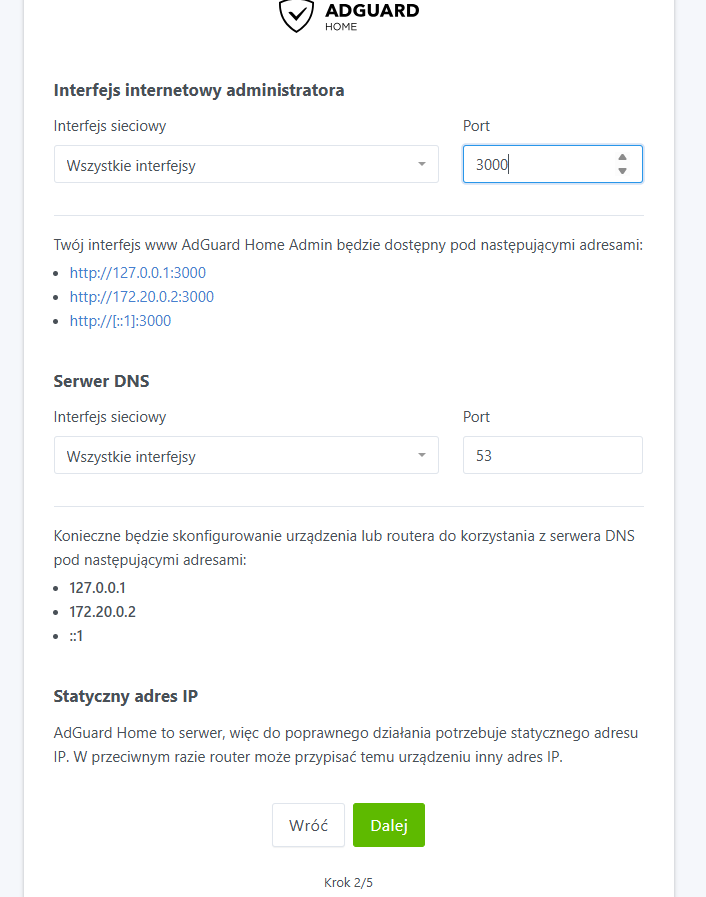
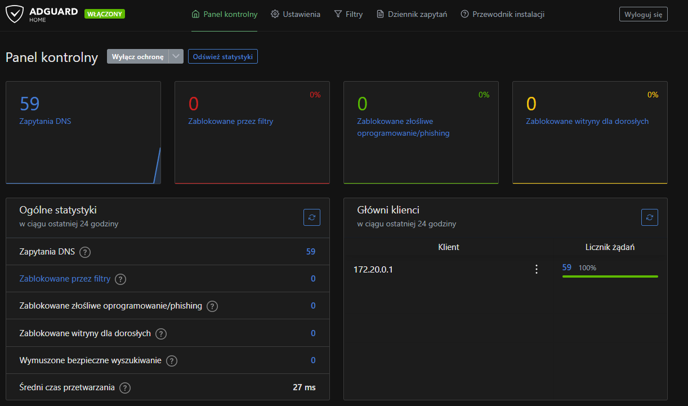
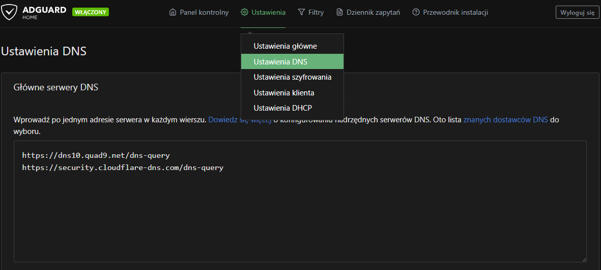
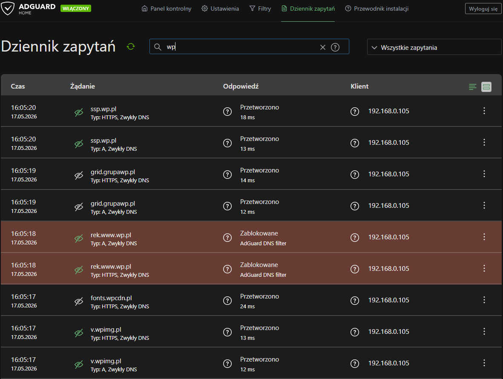
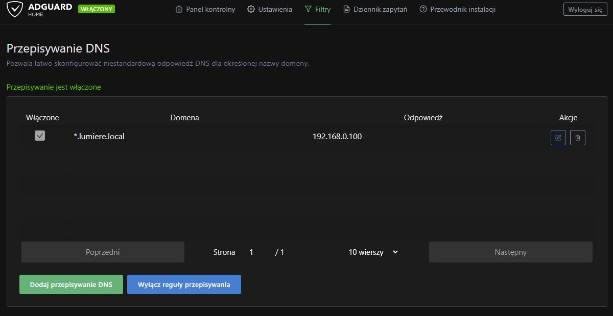

# Konfiguracja AdGuard Home  
  
W kolejnym etapie projektu uruchomiłem **AdGuard Home** jako lokalny serwer DNS z filtrowaniem reklam i trackerów.  
  
Po uruchomieniu Nextcloud, Tailscale i podstawowych usług kontenerowych chciałem dodać usługę, która będzie działała nie tylko jako kolejna aplikacja w Dockerze, ale też jako element infrastruktury sieciowej.  
  
AdGuard Home pozwala filtrować zapytania DNS, blokować reklamy i trackery oraz obserwować, jakie domeny są odpytywane przez urządzenia w sieci lokalnej.  
  
Na tym etapie przygotowałem:  
  
- katalogi danych dla AdGuard Home,  
- stack Docker Compose,  
- uruchomienie kontenera z poziomu Portainera,  
- dostęp do panelu konfiguracyjnego,  
- podstawową konfigurację DNS,  
- test działania filtrowania,  
- przygotowanie pod lokalne nazwy usług.

## Dlaczego AdGuard Home?  
  
AdGuard Home działa jako lokalny serwer DNS.  
  
Pozwala:  
  
- filtrować reklamy i trackery na poziomie DNS,  
- sprawdzać zapytania DNS z urządzeń w sieci,  
- dodawać własne reguły blokowania,  
- testować konfigurację DNS w sieci lokalnej,  
- lepiej zrozumieć, jak działa rozwiązywanie nazw domenowych.  
  
W tym projekcie AdGuard Home jest też dobrym przygotowaniem pod późniejsze lokalne nazwy usług, np.:  
  
```
nextcloud.lumiere.local  
portainer.lumiere.local  
grafana.lumiere.local
```

## Krok 1: Przygotowanie katalogów

Na potrzeby AdGuard Home przygotowałem osobny katalog w strukturze danych Dockera.

Docelowa struktura wygląda tak:

```
docker/data/adguard-home/
├── work/
└── conf/
```

Każdy katalog ma osobną rolę.

### work

Katalog `work` przechowuje dane robocze AdGuard Home.

### conf

Katalog `conf` przechowuje konfigurację usługi.

### Utworzenie katalogów
```
sudo mkdir -p /srv/dev-disk-by-uuid-CHANGE_ME/docker/data/adguard-home/work
sudo mkdir -p /srv/dev-disk-by-uuid-CHANGE_ME/docker/data/adguard-home/conf
```

W ścieżce:

```
/srv/dev-disk-by-uuid-CHANGE_ME/
```

trzeba podmienić `CHANGE_ME` na właściwy identyfikator dysku widoczny w OpenMediaVault.

## Krok 2: Port 53 i lokalny resolver DNS

AdGuard Home potrzebuje portu `53`, ponieważ działa jako serwer DNS.

Port `53` może być już zajęty przez lokalny resolver systemowy, np. `systemd-resolved`. Przed uruchomieniem kontenera warto sprawdzić, czy coś nasłuchuje na tym porcie:

```
sudo ss -tulpn | grep :53
```

Jeżeli port jest zajęty przez `systemd-resolved`, można go zatrzymać:

```
sudo systemctl stop systemd-resolved
sudo systemctl disable systemd-resolved.service
```

Następnie warto wykonać restart Raspberry Pi:

```
sudo reboot
```

## Krok 3: Dodanie stacka AdGuard Home w Portainerze

AdGuard Home uruchomiłem jako stack Docker Compose z poziomu Portainera.

W Portainerze przeszedłem do:

```
Portainer → Stacks → Add stack
```

Następnie utworzyłem stack o nazwie:

```
adguard-home
```

W polu edycji stacka wkleiłem zawartość pliku Compose przygotowanego dla AdGuard Home.

Właściwy plik Compose znajduje się tutaj:

AdGuard Home compose.yaml

W pliku Compose trzeba podmienić:

```
CHANGE_ME
```

na właściwy identyfikator dysku widoczny w OpenMediaVault.

Po deployu stacka, portainer pobrał obraz AdGuard Home i uruchomił kontener.

## Krok 4: Dostęp do panelu AdGuard Home

Po uruchomieniu kontenera panel konfiguracyjny AdGuard Home był dostępny pod adresem:

```
http://ADRES_IP_RASPBERRY_PI:3000
```

Przy pierwszym wejściu AdGuard Home wyświetla kreator konfiguracji.



W kreatorze można ustawić między innymi:

- interfejs, na którym usługa ma nasłuchiwać,
- port panelu administracyjnego,
- port DNS,
- konto administratora,
- hasło administratora.

W kreatorze zostawiłem nasłuchiwanie na wszystkich interfejsach i port `53` dla DNS. AdGuard Home pokazuje również adres kontenera Docker, ale dla urządzeń w sieci lokalnej jako DNS należy wskazać adres Raspberry Pi.

Po pierwszej konfiguracji panel AdGuard Home zaczął rejestrować zapytania DNS. Na tym etapie widać, że usługa działa, ale filtrowanie nie blokuje jeszcze żadnych domen, ponieważ konfiguracja list filtrów będzie wykonywana w kolejnym kroku.



## Krok 5: Konfiguracja DNS

Po pierwszym uruchomieniu skonfigurowałem AdGuard Home jako lokalny serwer DNS.

W panelu można ustawić upstream DNS, czyli serwery, do których AdGuard Home będzie przekazywał zapytania.

W panelu AdGuard Home przeszedłem do ustawień DNS i w sekcji głównych serwerów DNS dodałem dwa upstreamy DNS-over-HTTPS:

```
https://dns10.quad9.net/dns-query
https://security.cloudflare-dns.com/dns-query
```

W tej konfiguracji urządzenia w mojej sieci lokalnej korzystają z Raspberry Pi jako lokalnego serwera DNS, natomiast AdGuard Home przekazuje zapytania dalej do zewnętrznych resolverów.

Schemat wygląda tak:

```
Komputer / telefon / urządzenie w sieci
        ↓
AdGuard Home na Raspberry Pi
        ↓
Quad9 / Cloudflare Security DNS
```

Pierwszy upstream:

```
https://dns10.quad9.net/dns-query
```

to resolver DNS-over-HTTPS od Quad9. Dzięki użyciu DoH zapytania DNS pomiędzy AdGuard Home a zewnętrznym resolverem są przesyłane przez HTTPS.

Drugi upstream:

```
https://security.cloudflare-dns.com/dns-query
```

to wariant Cloudflare Security DNS, który jest nastawiony na blokowanie domen powiązanych z malware i zagrożeniami bezpieczeństwa.



Dzięki temu AdGuard Home działa jako lokalna warstwa filtrująca i logująca zapytania DNS, a zapytania wychodzące są przekazywane do zewnętrznych resolverów z dodatkowymi funkcjami bezpieczeństwa.

## Krok 6: Test działania i dziennik zapytań

Aby sprawdzić, czy AdGuard Home działa, na komputerze ustawiłem ręcznie DNS na adres Raspberry Pi.

Są dwa podstawowe podejścia:

1. ręczne ustawienie adresu Raspberry Pi jako DNS na wybranym urządzeniu,
2. ustawienie adresu Raspberry Pi jako DNS w routerze DHCP dla całej sieci.

W pierwszym etapie wybrałem test na pojedynczym urządzeniu, żeby sprawdzić działanie bez wpływania od razu na całą sieć domową.

Następnie w panelu AdGuard Home sprawdziłem, czy pojawiają się zapytania DNS.



Na screenie widać, że AdGuard Home odbiera zapytania DNS z urządzenia w sieci lokalnej. Część zapytań została przetworzona normalnie, a część została zablokowana przez filtr DNS. To potwierdza, że urządzenie korzysta z Raspberry Pi jako serwera DNS, a filtrowanie działa poprawnie.

## Krok 7: Listy filtrów

AdGuard Home pozwala dodawać listy filtrów blokujące reklamy, trackery i znane domeny telemetryczne.

W panelu można przejść do sekcji filtrów DNS i włączyć lub dodać wybrane listy.

Na tym etapie nie dodaję zbyt wielu list naraz. Zbyt agresywne filtrowanie może powodować problemy z działaniem niektórych stron lub aplikacji.

Najlepiej zacząć od podstawowych list, przetestować działanie sieci, a dopiero później rozszerzać filtrację.

## Krok 8: Lokalne rekordy DNS

AdGuard Home można wykorzystać również do lokalnych nazw usług.

W panelu AdGuard Home przeszedłem do sekcji:  
  
```
Filtry → Przepisywanie DNS
```

Następnie dodałem własne przepisywanie DNS.

Jako domenę podałem:

```
*.lumiere.local
```

Jako odpowiedź podałem lokalny adres IP Raspberry Pi:

```
192.168.0.100
```



Dzięki temu wszystkie subdomeny w domenie lokalnej `lumiere.local` wskazują na Raspberry Pi.

Przykłady:

```
nextcloud.lumiere.local → 192.168.0.100
portainer.lumiere.local → 192.168.0.100
adguard.lumiere.local   → 192.168.0.100
grafana.lumiere.local   → 192.168.0.100
```

Samo przepisywanie DNS nie decyduje jeszcze, do której aplikacji trafi ruch. Ono wskazuje tylko adres IP Raspberry Pi.

Rozdzielaniem ruchu między konkretne usługi zajmie się później Nginx Proxy Manager.

Przykład:

```
nextcloud.lumiere.local
        ↓
AdGuard Home zwraca 192.168.0.100
        ↓
Nginx Proxy Manager odbiera ruch
        ↓
Nextcloud
```

Dzięki temu zamiast wpisywać adres IP i port, można korzystać z czytelnych lokalnych nazw usług.

## Podsumowanie

AdGuard Home dodał do projektu warstwę lokalnego DNS.

Dzięki temu homelab nie jest tylko miejscem na usługi kontenerowe, ale zaczyna pełnić również rolę infrastruktury sieciowej.
