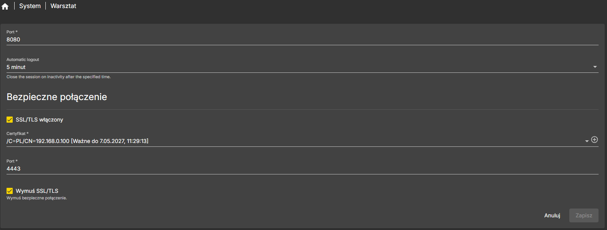
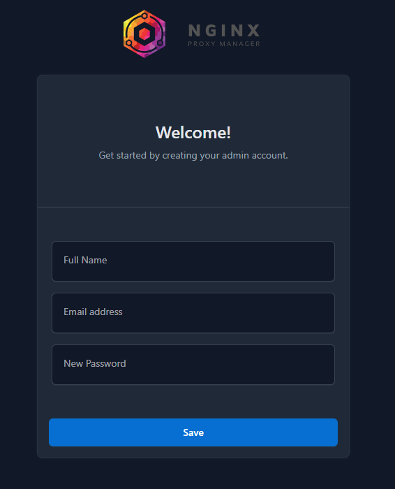
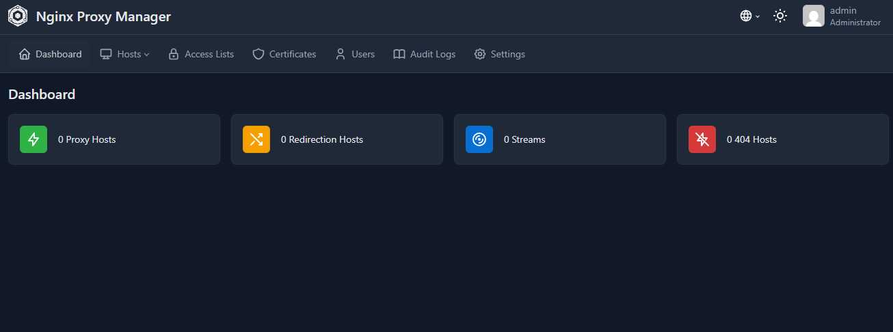
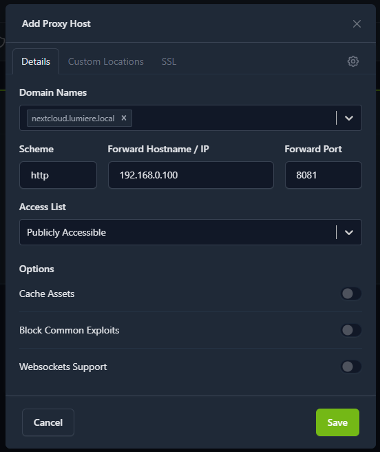
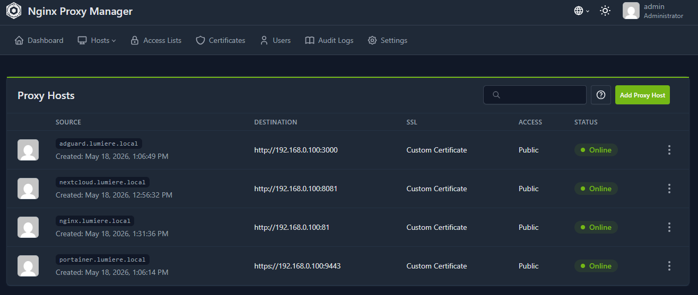
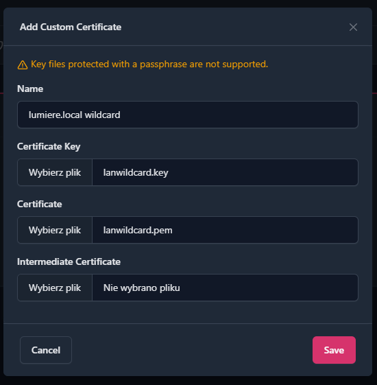
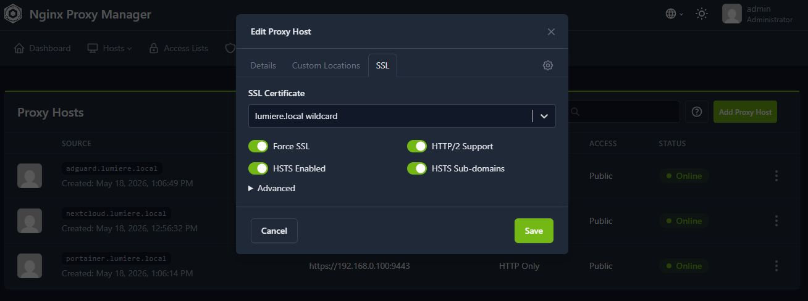

# Konfiguracja Nginx Proxy Manager  
  
W kolejnym etapie projektu uruchomiłem **Nginx Proxy Manager** jako reverse proxy dla usług działających w homelabie.  
  
Po uruchomieniu kilku usług kontenerowych dostęp do nich przez adres IP i port zaczął być mniej wygodny. Nginx Proxy Manager pozwala uporządkować dostęp do usług i korzystać z lokalnych nazw zamiast zapamiętywania portów.  
  
Na tym etapie przygotowałem:  
  
- katalogi danych dla Nginx Proxy Managera,  
- stack Docker Compose,  
- uruchomienie kontenera z poziomu Portainera,  
- dostęp do panelu administracyjnego,  
- lokalne proxy hosty dla usług,  
- przygotowanie pod lokalny certyfikat,  
- porządkowanie dostępu do usług po nazwach.

## Dlaczego Nginx Proxy Manager?  
  
Nginx Proxy Manager pozwala zarządzać reverse proxy z poziomu panelu webowego.  
  
Dzięki temu mogę kierować ruch z lokalnych nazw usług na odpowiednie kontenery i porty.  
  
Przykłady:  
  
```
nextcloud.lumiere.local → http://192.168.0.100:8081  
portainer.lumiere.local → https://192.168.0.100:9443  
adguard.lumiere.local → http://192.168.0.100:3000
```

Zamiast pamiętać porty usług, mogę używać czytelnych nazw.

W tym projekcie Nginx Proxy Manager będzie współpracował z AdGuard Home. AdGuard Home odpowiada za lokalne DNS, czyli wskazuje domeny `*.lumiere.local` na adres Raspberry Pi, a Nginx Proxy Manager decyduje, do której usługi ma trafić ruch.

Schemat działania:

```
nextcloud.lumiere.local
        ↓
AdGuard Home zwraca 192.168.0.100
        ↓
Nginx Proxy Manager odbiera ruch
        ↓
Nextcloud na porcie 8081
```

## Krok 1: Przygotowanie katalogów

Na potrzeby Nginx Proxy Managera przygotowałem katalogi w strukturze danych Dockera.

Docelowa struktura wygląda tak:

```
docker/data/nginx-proxy-manager/  
├── data/  
└── letsencrypt/
```

Każdy katalog ma osobną rolę.

### data

Katalog `data` przechowuje konfigurację Nginx Proxy Managera.

### letsencrypt

Katalog `letsencrypt` przechowuje certyfikaty.

W środowisku lokalnym mogę korzystać z certyfikatu samopodpisanego, ale katalog nadal zostawiam zgodnie ze standardową strukturą Nginx Proxy Managera.

Utworzenie katalogów przez SSH:

```
sudo mkdir -p /srv/dev-disk-by-uuid-CHANGE_ME/docker/data/nginx-proxy-manager/data

sudo mkdir -p /srv/dev-disk-by-uuid-CHANGE_ME/docker/data/nginx-proxy-manager/letsencrypt
```

W ścieżce:

```
/srv/dev-disk-by-uuid-CHANGE_ME/
```

trzeba podmienić `CHANGE_ME` na właściwy identyfikator dysku widoczny w OpenMediaVault.

## Krok 2: Konflikt portów 80 i 443

Nginx Proxy Manager używa portów:

```
80
443
81
```

Port `80` jest używany dla HTTP.

Port `443` jest używany dla HTTPS.

Port `81` jest używany dla panelu administracyjnego Nginx Proxy Managera.

Jeżeli OpenMediaVault działa na porcie `80`, może dojść do konfliktu. W takim przypadku warto przenieść panel OpenMediaVault na inny port, np.:

```
8080
```

Dzięki temu porty `80` i `443` mogą być używane przez Nginx Proxy Managera.



Przykładowo panel OpenMediaVault może być później dostępny pod adresem:

```
http://192.168.0.100:8080
```

a Nginx Proxy Manager przejmie porty:

```
http://192.168.0.100
https://192.168.0.100
```

## Krok 3: Dodanie stacka Nginx Proxy Manager w Portainerze

Nginx Proxy Manager uruchomiłem jako stack Docker Compose z poziomu Portainera.

W Portainerze przeszedłem do:

```
Portainer → Stacks → Add stack
```

Następnie utworzyłem stack o nazwie:

```
nginx-proxy-manager
```

W polu edycji stacka wkleiłem zawartość pliku Compose przygotowanego dla Nginx Proxy Managera.

Właściwy plik Compose znajduje się tutaj:

[Nginx Proxy Manager compose.yaml](../docker/nginx-proxy-manager/compose.yaml)

W pliku Compose trzeba podmienić:

```
CHANGE_ME
```

na właściwy identyfikator dysku widoczny w OpenMediaVault.

## Krok 4: Dostęp do panelu Nginx Proxy Manager



Po uruchomieniu kontenera panel administracyjny Nginx Proxy Managera był dostępny pod adresem:

```
http://ADRES_IP_RASPBERRY_PI:81
```

Po pierwszym logowaniu należy zmienić domyślne dane administratora.

Domyślny panel Nginx Proxy Managera służy do tworzenia proxy hostów, zarządzania certyfikatami i przekierowywania ruchu do usług działających na Raspberry Pi.



## Krok 5: Dodanie pierwszego proxy hosta

Po zalogowaniu do panelu dodałem pierwszy proxy host. Na początku postanowiłem wykorzystać Nextcloud

```
Domain Names: nextcloud.lumiere.local
Scheme: http
Forward Hostname / IP: 192.168.0.100
Forward Port: 8081
```

Po zapisaniu konfiguracji wejście na:

```
http://nextcloud.lumiere.local
```

powinno kierować do Nextcloud.



Warunkiem jest poprawne rozwiązanie nazwy DNS. W tym projekcie odpowiada za to AdGuard Home, gdzie wcześniej dodałem przepisywanie DNS:

```
*.lumiere.local → 192.168.0.100
```

Dzięki temu `nextcloud.lumiere.local` wskazuje na Raspberry Pi, a Nginx Proxy Manager przekazuje ruch do kontenera Nextcloud.

## Krok 6: Proxy hosty dla Portainera i AdGuard Home i Nginx  
  
Po dodaniu proxy hosta dla Nextcloud przygotowałem analogiczne wpisy dla kolejnych usług działających na Raspberry Pi.  
  
Dzięki temu mogę korzystać z czytelnych lokalnych nazw zamiast wpisywania adresu IP oraz portu usługi.  

### Proxy host dla Portainera  
  
Portainer działa lokalnie pod adresem:  
  
```
https://192.168.0.100:9443
```

W Nginx Proxy Managerze dodałem nowy proxy host:

```
Domain Names: portainer.lumiere.local
Scheme: https
Forward Hostname / IP: 192.168.0.100
Forward Port: 9443
```

Po zapisaniu konfiguracji panel Portainera był dostępny pod adresem:

```
https://portainer.lumiere.local
```

W tym przypadku jako schemat wybrałem `https`, ponieważ Portainer działa u mnie na porcie `9443`, czyli po HTTPS.

### Proxy host dla AdGuard Home

Analogicznie dodałem proxy host dla panelu AdGuard Home.

AdGuard Home działa lokalnie pod adresem:

```
http://192.168.0.100:3000
```

W Nginx Proxy Managerze dodałem nowy proxy host:

```
Domain Names: adguard.lumiere.local
Scheme: http
Forward Hostname / IP: 192.168.0.100
Forward Port: 3000
```

Po zapisaniu konfiguracji panel AdGuard Home był dostępny pod adresem:

```
http://adguard.lumiere.local
```

W tym przypadku jako schemat wybrałem `http`, ponieważ panel AdGuard Home działa u mnie na porcie `3000` bez HTTPS.

### Proxy host dla Nginx

Dodałem równie proxy host dla panelu Nginx.

Nginx działa lokalnie pod adresem:

```
http://192.168.0.100:81
```

W Nginx Proxy Managerze dodałem nowy proxy host:

```
Domain Names: nginx.lumiere.local
Scheme: http
Forward Hostname / IP: 192.168.0.100
Forward Port: 81
```

Po zapisaniu konfiguracji panel Nginx był dostępny pod adresem:

```
http://nginx.lumiere.local
```

Po dodaniu proxy hostów w panelu Nginx Proxy Manager widać cztery lokalne domeny: `adguard.lumiere.local`, `nextcloud.lumiere.local`, `portainer.lumiere.local` oraz `nginx.lumiere.local`. Każda z nich kieruje na odpowiednią usługę działającą na Raspberry Pi.



## Krok 7: Lokalny certyfikat wildcard

Do środowiska lokalnego można przygotować certyfikat samopodpisany dla domeny lokalnej.

Podłączyłem się po ssh do raspbery pi i stworzyłem certyfikat samopodpisany:

```
openssl req -x509 -newkey ec -pkeyopt ec_paramgen_curve:prime256v1 -nodes -days 36500 \
  -subj "/C=PL/ST=DOLNYSLASK/L=Wroclaw/O=MojDom/OU=MojDom/CN=*.lumiere.local/emailAddress=admin@lumiere.local" \
  -keyout lanwildcard.key \
  -out lanwildcard.pem \
  -addext "subjectAltName=DNS:lumiere.local,DNS:*.lumiere.local"
```

Taki certyfikat można dodać w Nginx Proxy Managerze i wykorzystać dla lokalnych usług.



Po dodaniu certyfikatu samopodpisanego w Nginx Proxy Managerze przypisałem go do lokalnych proxy hostów.

W panelu przeszedłem do:
```
Hosts → Proxy Hosts
```

Następnie edytowałem wybrany proxy host, np.:

```
nextcloud.lumiere.local
```

W zakładce `SSL` wybrałem wcześniej dodany certyfikat:

```
lumiere.local wildcard
```

Następnie włączyłem opcje:

```
Force SSL
HTTP/2 Support
HSTS Enabled
HSTS Sub-domains
```



Po zapisaniu konfiguracji usługa może być dostępna przez HTTPS, np.:

```
https://nextcloud.lumiere.local
```

Ten sam certyfikat można przypisać również do pozostałych lokalnych proxy hostów, np.:

```
portainer.lumiere.local
adguard.lumiere.local
nginx.lumiere.local
```

**Ważne: certyfikat samopodpisany trzeba dodać jako zaufany na urządzeniach klienckich, jeżeli chcę uniknąć ostrzeżeń w przeglądarce. Można go dodać w każdej przeglądarce wyszukując w jej ustawieniach opcje związaną z certyfikatami.**

## Krok 8: Test działania

Po dodaniu certyfikatu do proxy hosta sprawdziłem działanie w przeglądarce. Przykład dla Nextclouda.

```
https://nextcloud.lumiere.local
```

## Krok 10: Integracja z Tailscale

Nginx Proxy Manager można połączyć z Tailscale, żeby korzystać z nazw usług również poza siecią lokalną.

W takim scenariuszu urządzenie łączy się z Raspberry Pi przez Tailscale, a lokalne nazwy usług wskazują na adres Raspberry Pi.

Dzięki temu można wejść np. na:

```
nextcloud.lumiere.local
```

będąc poza domem.

Po skonfigurowaniu lokalnych domen w AdGuard Home i dodaniu proxy hostów w Nginx Proxy Managerze chciałem, żeby te same nazwy działały również przez Tailscale.

Żeby tego dokonać, dodałem AdGuard Home jako globalny serwer DNS w panelu Tailscale.

Najpierw sprawdziłem adres Tailscale Raspberry Pi:

```
tailscale ip -4
```

Wynik to adres z zakresu Tailscale, np.:

```
100.x.x.x
```

To właśnie ten adres należy wpisać w panelu Tailscale jako globalny nameserver, ponieważ AdGuard Home działa na Raspberry Pi.

W panelu Tailscale przeszedłem do:

```
DNS → Nameservers → Global nameservers
```

Następnie dodałem adres Tailscale Raspberry Pi, np.:

```
100.x.x.x
```

Włączyłem również opcję:

```
Override DNS servers
```

Dzięki temu urządzenia połączone z Tailscale korzystają z AdGuard Home jako serwera DNS.

Schemat działania wygląda tak:

```
Urządzenie poza domem
        ↓
Tailscale
        ↓
AdGuard Home na Raspberry Pi
        ↓
nextcloud.lumiere.local → 192.168.0.100
        ↓
Nginx Proxy Manager
        ↓
Nextcloud
```

## Podsumowanie

Nginx Proxy Manager porządkuje dostęp do usług uruchomionych w homelabie.

Zamiast korzystać z wielu adresów IP i portów, mogę używać lokalnych nazw usług. To zwiększa czytelność środowiska i przygotowuje projekt pod kolejne elementy, takie jak certyfikaty, lokalny DNS i dostęp przez Tailscale.

W połączeniu z AdGuard Home i Tailscale tworzy to wygodną warstwę dostępu do usług:

```
Tailscale → prywatny dostęp zdalny
AdGuard Home → lokalny DNS
Nginx Proxy Manager → reverse proxy do usług
```
