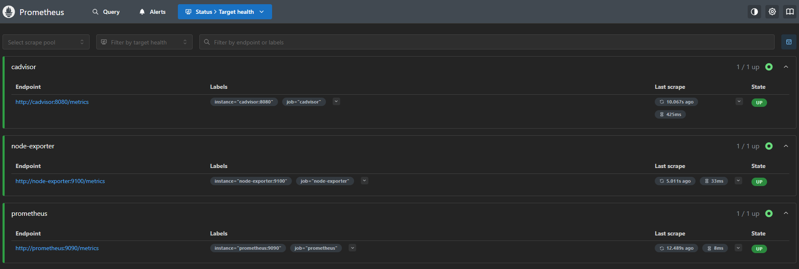
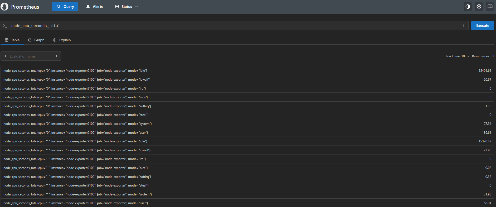
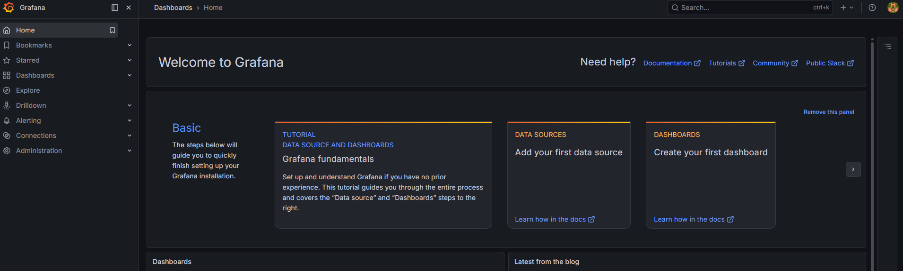
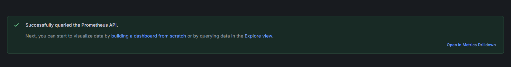
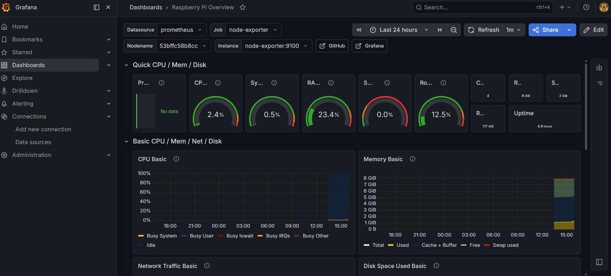
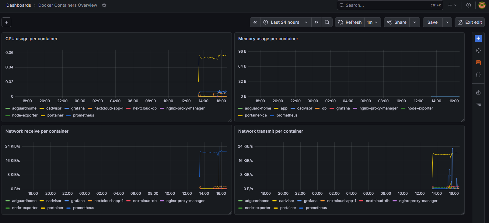
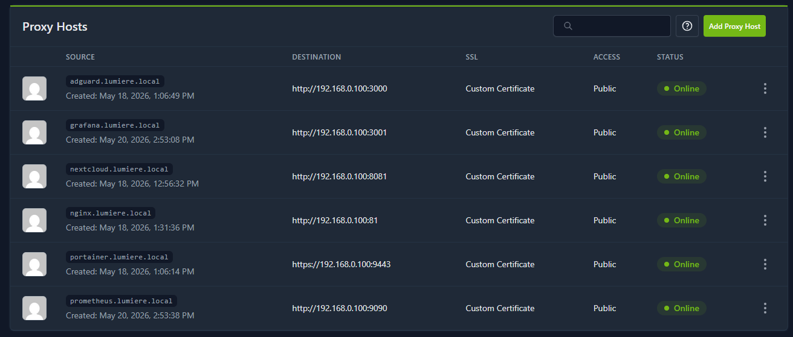

# Monitoring metryk: Prometheus, Grafana, Node Exporter i cAdvisor  
  
W kolejnym etapie projektu przygotowałem monitoring metryk dla Raspberry Pi oraz kontenerów Docker.  
  
Po uruchomieniu kilku usług, takich jak Nextcloud, AdGuard Home i Nginx Proxy Manager, chciałem mieć lepszy wgląd w działanie całego środowiska. Sam fakt, że usługa działa, nie wystarcza. Ważne jest również to, ile zasobów zużywa Raspberry Pi, ile miejsca zostało na dysku i jak zachowują się kontenery.  
  
Do monitoringu metryk wykorzystałem:  
  
- **Prometheus** — zbieranie metryk,  
- **Node Exporter** — metryki systemu Raspberry Pi,  
- **cAdvisor** — metryki kontenerów Docker,  
- **Grafana** — wizualizacja danych.  
  
Na tym etapie przygotowałem:  
  
- katalogi danych dla Prometheusa i Grafany,  
- plik konfiguracyjny Prometheusa,  
- stack Docker Compose,  
- uruchomienie Prometheusa, Grafany, Node Exportera i cAdvisora,  
- dodanie Prometheusa jako źródła danych w Grafanie,  
- podstawowy test zbierania metryk,  
- przygotowanie pod dashboardy dla Raspberry Pi i kontenerów Docker.

## Dlaczego Prometheus i Grafana?  
  
Prometheus odpowiada za zbieranie metryk z różnych źródeł.  
  
W tym projekcie Prometheus zbiera dane z:  
  
- Raspberry Pi przez Node Exporter,  
- kontenerów Docker przez cAdvisor,  
- samego Prometheusa.  
  
Grafana odpowiada za wizualizację tych danych.  
  
Dzięki temu mogę obserwować:  
  
- użycie CPU,  
- użycie RAM,  
- zajętość dysków,  
- obciążenie systemu,  
- ruch sieciowy,  
- zużycie zasobów przez kontenery,  
- zachowanie środowiska w czasie.

## Rola poszczególnych usług

### Prometheus

Prometheus zbiera metryki i przechowuje je w bazie czasowej.

W tym projekcie Prometheus odpytuje:

```
prometheus:9090
node-exporter:9100
cadvisor:8080
```

### Node Exporter

Node Exporter udostępnia metryki systemu operacyjnego.

Dzięki niemu mogę monitorować Raspberry Pi jako hosta:

- CPU,
- RAM,
- dyski,
- sieć,
- load average,
- system plików.

### cAdvisor

cAdvisor udostępnia metryki kontenerów Docker.

Dzięki niemu mogę sprawdzić:

- ile CPU zużywa konkretny kontener,
- ile RAM zużywa kontener,
- jaki jest ruch sieciowy kontenera,
- jakie są operacje wejścia/wyjścia,
- które kontenery najbardziej obciążają Raspberry Pi.

### Grafana

Grafana służy do tworzenia dashboardów.

W tym projekcie Grafana będzie pokazywać:

- dashboard systemowy Raspberry Pi,
- dashboard kontenerów Docker,
- podstawowe statystyki środowiska.

## Krok 1: Przygotowanie katalogów

Na potrzeby monitoringu przygotowałem osobną strukturę katalogów w katalogu Dockera.  
  
W tym etapie potrzebne są dwa typy katalogów:  
  
- katalogi danych dla Prometheusa i Grafany,  
- katalog z plikiem konfiguracyjnym Prometheusa.  
  
Docelowa struktura danych wygląda tak:  
  
``` 
docker/data/monitoring/  
├── prometheus/  
└── grafana/
```

Dodatkowo pliki konfiguracyjne dla stacka monitoringu trzymam w osobnym katalogu:

```
docker/prometheus-grafana/
└── prometheus.yml
```

Katalog `docker/data/monitoring/prometheus` przechowuje dane Prometheusa.

Katalog `docker/data/monitoring/grafana` przechowuje dane Grafany, konfigurację oraz dashboardy.

Katalog `docker/prometheus-grafana` przechowuje plik konfiguracyjny `prometheus.yml`, który jest później podmontowany do kontenera Prometheusa.

Utworzenie katalogów przez SSH:

```
sudo mkdir -p /srv/dev-disk-by-uuid-CHANGE_ME/docker/data/monitoring/prometheus
sudo mkdir -p /srv/dev-disk-by-uuid-CHANGE_ME/docker/data/monitoring/grafana
sudo mkdir -p /srv/dev-disk-by-uuid-CHANGE_ME/docker/prometheus-grafana
```

W ścieżce:

```
/srv/dev-disk-by-uuid-CHANGE_ME/
```

trzeba podmienić `CHANGE_ME` na właściwy identyfikator dysku widoczny w OpenMediaVault.

Po wykonaniu tych komend struktura na Raspberry Pi powinna wyglądać podobnie do:

```
/srv/dev-disk-by-uuid-CHANGE_ME/docker/
├── data/
│   └── monitoring/
│       ├── prometheus/
│       └── grafana/
└── prometheus-grafana/
    └── prometheus.yml
```

Plik `prometheus.yml` zostanie utworzony w kolejnym kroku.


Po utworzeniu katalogów nadałem odpowiednie uprawnienia katalogom danych.

Prometheus zapisuje dane w katalogu `/prometheus`, który jest podmontowany z hosta. W mojej konfiguracji katalog danych Prometheusa musi być zapisywalny dla użytkownika o UID `65534`.

Grafana zapisuje dane w katalogu `/var/lib/grafana`, który również jest podmontowany z hosta. Oficjalny kontener Grafany używa użytkownika o UID `472`, dlatego katalog danych Grafany musi należeć do `472:472`

```
sudo chown -R 65534:65534 /srv/dev-disk-by-uuid-CHANGE_ME/docker/data/monitoring/prometheus  
sudo chmod -R 755 /srv/dev-disk-by-uuid-CHANGE_ME/docker/data/monitoring/prometheus  
  
sudo chown -R 472:472 /srv/dev-disk-by-uuid-CHANGE_ME/docker/data/monitoring/grafana  
sudo chmod -R 755 /srv/dev-disk-by-uuid-CHANGE_ME/docker/data/monitoring/grafana
```

Dzięki temu Prometheus i Grafana mogą zapisywać dane w swoich katalogach po uruchomieniu kontenerów.

## Krok 2: Plik konfiguracyjny Prometheusa  
  
Prometheus potrzebuje pliku konfiguracyjnego, w którym określam, skąd ma pobierać metryki.  
  
Ten plik nie jest uruchamiany osobno. Nie jest to stack ani skrypt. Jest to plik konfiguracyjny, który Prometheus odczytuje podczas startu kontenera.  
  
W repozytorium plik znajduje się tutaj:  
  
```
docker/prometheus-grafana/prometheus.yml
```

Na Raspberry Pi umieściłem go w katalogu:

```
/srv/dev-disk-by-uuid-CHANGE_ME/docker/prometheus-grafana/prometheus.yml
```

Następnie wkleiłem konfigurację:

```
global:
  scrape_interval: 15s

scrape_configs:
  - job_name: "prometheus"
    static_configs:
      - targets:
          - "prometheus:9090"

  - job_name: "node-exporter"
    static_configs:
      - targets:
          - "node-exporter:9100"

  - job_name: "cadvisor"
    static_configs:
      - targets:
          - "cadvisor:8080"
```

Parametr:

```
scrape_interval: 15s
```

oznacza, że Prometheus będzie pobierał metryki co 15 sekund.

W konfiguracji dodałem trzy źródła metryk:

- `prometheus:9090` — metryki samego Prometheusa,
- `node-exporter:9100` — metryki systemu Raspberry Pi,
- `cadvisor:8080` — metryki kontenerów Docker.

Ważne jest to, że nazwy `prometheus`, `node-exporter` i `cadvisor` są nazwami usług zdefiniowanych w pliku `compose.yaml`. Kontenery działające w tym samym stacku Docker Compose mogą komunikować się ze sobą po nazwach usług.

## Krok 3: Dodanie stacka w Portainerze

Monitoring uruchomiłem jako jeden stack Docker Compose z poziomu Portainera.

W Portainerze przeszedłem do:

```
Portainer → Stacks → Add stack
```

Następnie utworzyłem stack o nazwie:

```
prometheus-grafana
```

W polu edycji stacka wkleiłem zawartość pliku Compose przygotowanego dla monitoringu.

Właściwy plik Compose znajduje się tutaj:

[Prometheus i Grafana compose.yaml](../docker/prometheus-grafana/compose.yaml)

W pliku Compose trzeba podmienić:

```
CHANGE_ME
```

na właściwy identyfikator dysku widoczny w OpenMediaVault.

Po wklejeniu konfiguracji kliknąłem:

```
Deploy the stack
```

Portainer pobrał wymagane obrazy i uruchomił kontenery.

## Krok 4: Sprawdzenie kontenerów

Po uruchomieniu stacka sprawdziłem, czy wszystkie kontenery działają poprawnie.

W Portainerze powinny być widoczne kontenery:

```
prometheus
grafana
node-exporter
cadvisor
```

Można to sprawdzić również z poziomu SSH:

```
sudo docker ps
```

Jeżeli wszystkie kontenery mają status `running`, można przejść do testowania Prometheusa.

## Krok 5: Dostęp do Prometheusa

Prometheus jest dostępny lokalnie pod adresem:

```
http://ADRES_IP_RASPBERRY_PI:9090
```

Przykład:

```
http://192.168.0.100:9090
```

Po wejściu do panelu Prometheusa można sprawdzić, czy źródła metryk są aktywne.

W panelu Prometheusa przeszedłem do:

```
Status → Targets
```

W tym miejscu powinny być widoczne targety:

```
prometheus
node-exporter
cadvisor
```

Przy każdym z nich widnieje status up, co oznacza, że Prometheus poprawnie zbiera metryki:



## Krok 6: Test zapytań w Prometheusie

Po sprawdzeniu targetów wykonałem kilka prostych zapytań testowych.

Przykład metryki z Node Exportera:

```
node_cpu_seconds_total
```

Przykład metryki pamięci RAM:

```
node_memory_MemAvailable_bytes
```

Przykład metryki z cAdvisora:

```
container_cpu_usage_seconds_total
```

Prometheus zwraca wyniki, co oznacza, że metryki są poprawnie pobierane.



## Krok 7: Dostęp do Grafany

Grafana jest dostępna lokalnie pod adresem:

```
http://ADRES_IP_RASPBERRY_PI:3001
```

Port `3001` został użyty po stronie Raspberry Pi, ponieważ port `3000` jest już zajęty przez AdGuard Home.

Po pierwszym wejściu zalogowałem się do Grafany i zmieniłem domyślne hasło administratora.



## Krok 8: Dodanie Prometheusa jako źródła danych w Grafanie

Po zalogowaniu do Grafany dodałem Prometheusa jako źródło danych.

W Grafanie przeszedłem do:

```
Connections → Data sources → Add data source
```

Następnie wybrałem:

```
Prometheus
```

Jako adres Prometheusa podałem:

```
http://prometheus:9090
```

Nie używam tutaj adresu:

```
http://192.168.0.100:9090
```

ponieważ Grafana i Prometheus działają w tym samym stacku Docker Compose. Kontenery mogą komunikować się między sobą po nazwach usług.

W tym przypadku usługa Prometheus nazywa się:

```
prometheus
```

Dlatego z punktu widzenia kontenera Grafany poprawny adres to:

```
http://prometheus:9090
```

Po zapisaniu konfiguracji kliknąłem test połączenia.



W moim przypadku połączenie przebiegło bez problemów.

## Krok 9: Dashboard Raspberry Pi

Po dodaniu Prometheusa jako źródła danych w Grafanie przygotowałem pierwszy dashboard dla Raspberry Pi.

Dashboard korzysta z metryk zbieranych przez **Node Exportera**, który udostępnia informacje o systemie operacyjnym hosta. Dzięki temu mogę obserwować stan Raspberry Pi jako maszyny, na której działają wszystkie kontenery i usługi homelabowe.  
  
W Grafanie przeszedłem do:

```
Dashboards → New → Import
```

Następnie w polu:

```
Grafana.com dashboard URL or ID
```

wpisałem ID gotowego dashboardu:

```
1860
```

Po kliknięciu `Load` wybrałem źródło danych:

```
Prometheus
```

i zaimportowałem dashboard.



Dashboard Raspberry Pi pokazuje między innymi:

- użycie CPU,
- użycie pamięci RAM,
- użycie swap,
- zajętość systemu plików,
- ruch sieciowy,
- czas działania systemu,
- podstawowe informacje o obciążeniu hosta.

Dzięki temu mogę szybko sprawdzić, czy Raspberry Pi ma wystarczający zapas zasobów i czy uruchomione kontenery nie przeciążają systemu.

Na tym etapie wykorzystałem gotowy dashboard jako punkt startowy. Część paneli może wymagać późniejszego dopasowania do konkretnego środowiska, ale podstawowe metryki Raspberry Pi, takie jak CPU, RAM, dysk i uptime, są już widoczne.

## Krok 10: Dashboard kontenerów Docker

Drugim dashboardem, który przygotowałem, był dashboard dla kontenerów Docker.  
  
Ten dashboard korzysta z metryk zbieranych przez **cAdvisora** i odczytywanych przez **Prometheusa**. Dzięki temu mogę obserwować, jak poszczególne kontenery wpływają na obciążenie Raspberry Pi.  
  
Finalnie przygotowałem prosty własny dashboard, żeby lepiej zrozumieć metryki kontenerów i dopasować widok do mojego środowiska.  
  
W Grafanie przeszedłem do:  
  
```
Dashboards → New dashboard
```

Następnie kliknąłem:

```
Panel
```

Jako źródło danych wybrałem:

```
Prometheus
```

W edytorze zapytań przełączyłem tryb z `Builder` na:

```
Code
```

Dzięki temu mogłem wpisać własne zapytania.

### Panel CPU usage per container

Pierwszy panel pokazuje użycie CPU przez kontenery.

Zapytanie:

```
sum by (container_label_com_docker_compose_service) (
  rate(container_cpu_usage_seconds_total{container_label_com_docker_compose_service!=""}[5m])
)
```

Jako tytuł panelu ustawiłem:

```
CPU usage per container
```

### Panel Memory usage per container

Drugi panel pokazuje użycie pamięci RAM przez kontenery.

Zapytanie:

```
sum by (container_label_com_docker_compose_service) (
  container_memory_usage_bytes{container_label_com_docker_compose_service!=""}
)
```

Jako tytuł panelu ustawiłem:

```
Memory usage per container
```

W ustawieniach panelu ustawiłem jednostkę:

```
bytes
```

Dzięki temu Grafana automatycznie pokazuje wartości w czytelnej formie, np. KiB, MiB albo GiB.

### Panel Network receive per container

Trzeci panel pokazuje ruch sieciowy przychodzący do kontenerów.

Zapytanie:

```
sum by (container_label_com_docker_compose_service) (
  rate(container_network_receive_bytes_total{container_label_com_docker_compose_service!=""}[5m])
)
```

Jako tytuł panelu ustawiłem:

```
Network receive per container
```

W ustawieniach panelu ustawiłem jednostkę:

```
bytes/sec
```

### Panel Network transmit per container

Czwarty panel pokazuje ruch sieciowy wychodzący z kontenerów.

Zapytanie:

```
sum by (container_label_com_docker_compose_service) (
  rate(container_network_transmit_bytes_total{container_label_com_docker_compose_service!=""}[5m])
)
```

Jako tytuł panelu ustawiłem:

```
Network transmit per container
```

W ustawieniach panelu ustawiłem jednostkę:

```
bytes/sec
```

Po dodaniu paneli zapisałem dashboard pod nazwą:

```
Docker Containers Overview
```



Dashboard pokazuje podstawowe metryki kontenerów:

- użycie CPU,
- użycie pamięci RAM,
- ruch sieciowy przychodzący,
- ruch sieciowy wychodzący.

Dzięki temu mogę szybko sprawdzić, które kontenery generują największe obciążenie i czy któraś usługa nie zachowuje się nietypowo.

W zapytaniach użyłem etykiety:

```
container_label_com_docker_compose_service
```

Zamiast pełnych etykiet cAdvisora. Dzięki temu legenda w Grafanie jest czytelniejsza i pokazuje nazwy usług ze stacków Docker Compose, np. `grafana`, `prometheus`, `cadvisor`, `nginx-proxy-manager`, `nextcloud-db` albo `portainer`.

## Krok 11: Dostęp przez Nginx Proxy Manager  
  
Po uruchomieniu Grafany i Prometheusa dodałem dla nich lokalne nazwy w Nginx Proxy Managerze.  
  
Dzięki temu nie muszę korzystać bezpośrednio z adresu IP oraz portów usług. Zamiast tego mogę wejść na czytelne lokalne adresy:  
  
```
grafana.lumiere.local  
prometheus.lumiere.local
```

### Proxy host dla Grafany

W Nginx Proxy Managerze dodałem nowy proxy host dla Grafany.

Ustawiłem:

```
Domain Names: grafana.lumiere.local
Scheme: http
Forward Hostname / IP: 192.168.0.100
Forward Port: 3001
```

Grafana działa lokalnie na porcie `3001`, ponieważ port `3000` jest już używany przez AdGuard Home.

### Proxy host dla Prometheusa

Analogicznie dodałem proxy host dla Prometheusa.

Ustawiłem:

```
Domain Names: prometheus.lumiere.local  
Scheme: http  
Forward Hostname / IP: 192.168.0.100  
Forward Port: 9090
```

Prometheus działa lokalnie na porcie `9090`.

Po dodaniu proxy hostów przypisałem do nich również lokalny certyfikat wildcard przygotowany wcześniej dla domeny.



## Troubleshooting: Prometheus i Grafana restartują się przez uprawnienia  
  
Podczas pierwszego uruchomienia stacka Prometheus i Grafana zaczęły się restartować.  
  
W Portainerze kontenery miały stan `Restarting`, a w logach Prometheusa pojawił się błąd:  
  
```
open /prometheus/queries.active: permission denied  
panic: Unable to create mmap-ed active query log
```

W logach Grafany pojawił się błąd:

```
GF_PATHS_DATA='/var/lib/grafana' is not writable
mkdir: can't create directory '/var/lib/grafana/plugins': Permission denied
```

Problem wynikał z uprawnień do katalogów danych podmontowanych z hosta do kontenerów.

Katalog Prometheusa:

```
/srv/dev-disk-by-uuid-CHANGE_ME/docker/data/monitoring/prometheus
```

powinien być zapisywalny dla użytkownika kontenera Prometheus.

Katalog Grafany:

```
/srv/dev-disk-by-uuid-CHANGE_ME/docker/data/monitoring/grafana
```

powinien być zapisywalny dla użytkownika kontenera Grafany.

Problem rozwiązałem przez ustawienie właścicieli katalogów:

```
sudo chown -R 65534:65534 /srv/dev-disk-by-uuid-CHANGE_ME/docker/data/monitoring/prometheus
sudo chmod -R 755 /srv/dev-disk-by-uuid-CHANGE_ME/docker/data/monitoring/prometheus

sudo chown -R 472:472 /srv/dev-disk-by-uuid-CHANGE_ME/docker/data/monitoring/grafana
sudo chmod -R 755 /srv/dev-disk-by-uuid-CHANGE_ME/docker/data/monitoring/grafana
```

Następnie zrestartowałem kontenery:

```
sudo docker restart prometheus grafana
```

Po zmianie uprawnień kontenery uruchomiły się poprawnie.

## Podsumowanie

Prometheus i Grafana dodają do projektu warstwę obserwowalności.

Dzięki nim mogę nie tylko sprawdzić, czy usługa działa, ale też zobaczyć, jak Raspberry Pi i kontenery zachowują się w czasie.
