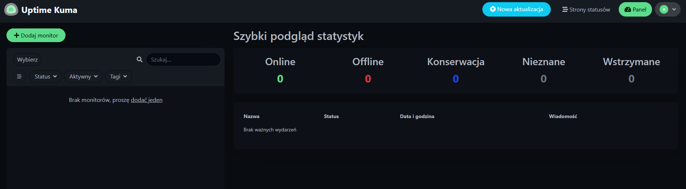
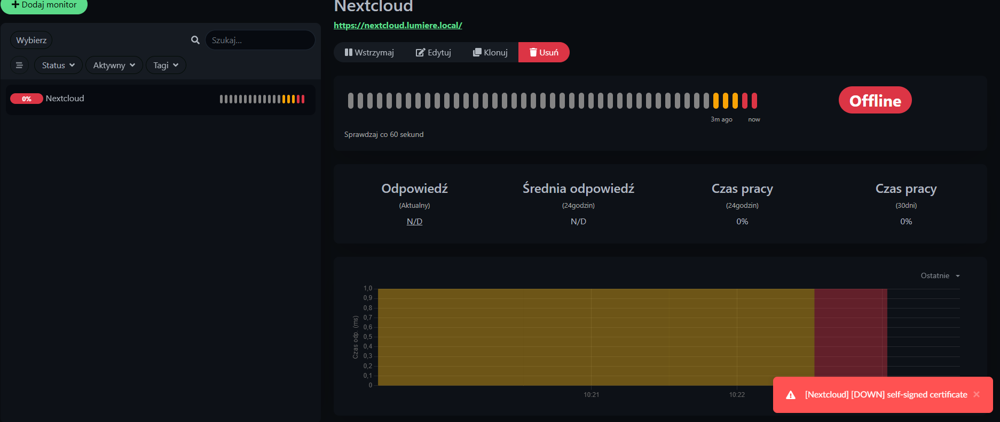
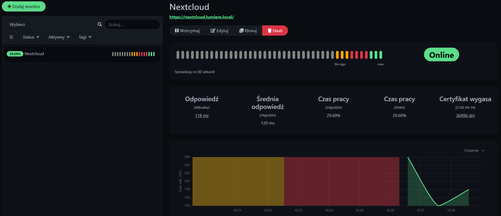
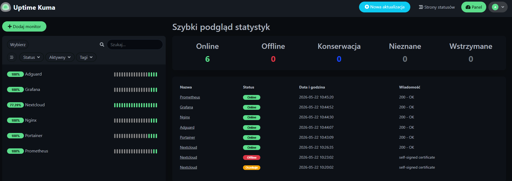
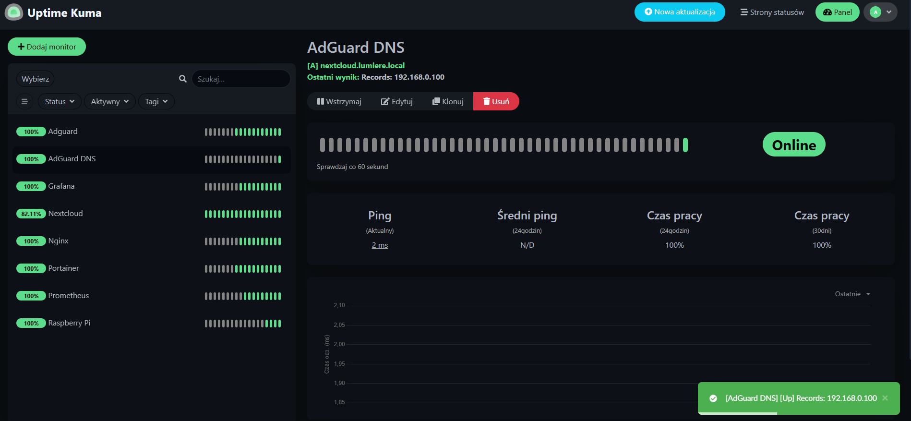
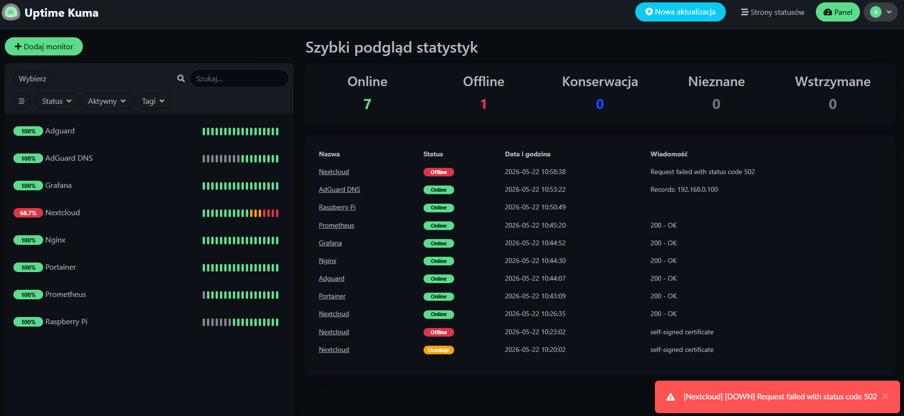
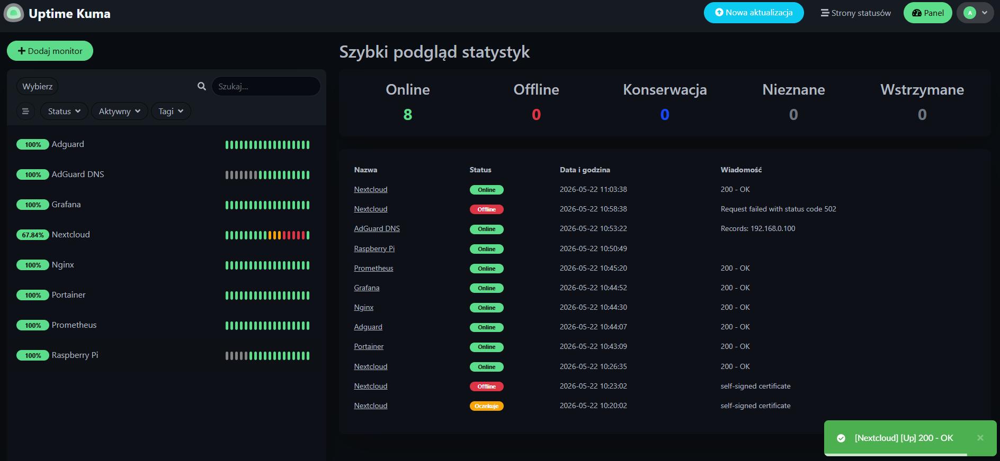
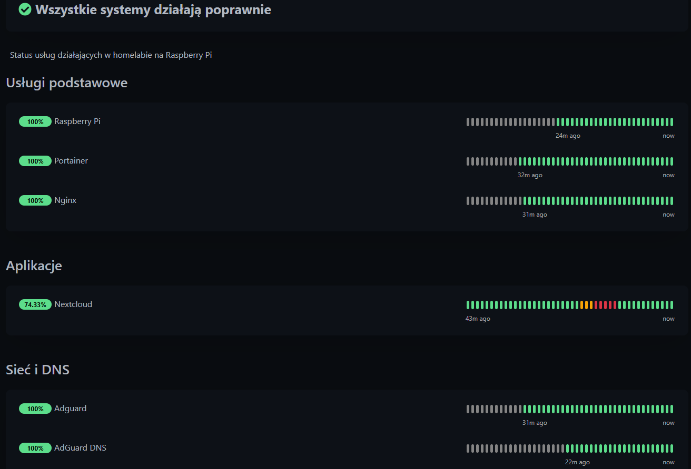

# Monitoring dostępności: Uptime Kuma

W kolejnym etapie projektu uruchomiłem **Uptime Kuma** jako narzędzie do monitorowania dostępności usług w homelabie.  
  
Po przygotowaniu monitoringu metryk opartego o Prometheusa i Grafanę chciałem dodać prosty panel, który pokaże, czy konkretne usługi odpowiadają. Prometheus i Grafana pokazują metryki, takie jak CPU, RAM, dysk czy obciążenie kontenerów, natomiast Uptime Kuma odpowiada na prostsze pytanie: czy dana usługa działa i jest dostępna.  
  
Na tym etapie przygotowałem:  
  
- katalog danych dla Uptime Kuma,  
- stack Docker Compose,  
- uruchomienie kontenera z poziomu Portainera,  
- dodanie monitorów dla usług homelabowych,  
- test zatrzymania usługi,  
- dostęp przez Nginx Proxy Manager,  
- przygotowanie pod późniejsze powiadomienia.  
  
---  
  
## Dlaczego Uptime Kuma?  
  
Uptime Kuma służy do prostego monitorowania dostępności usług.  
  
W tym projekcie będzie odpowiadać za sprawdzanie, czy działają między innymi:  
  
- Nextcloud,  
- Portainer,  
- AdGuard Home,  
- Nginx Proxy Manager,  
- Grafana,  
- Prometheus,  
- Raspberry Pi.

Prometheus i Grafana pokazują szczegółowe metryki, ale Uptime Kuma daje szybki podgląd stanu usług.

## Krok 1: Przygotowanie katalogu

Na potrzeby Uptime Kuma przygotowałem osobny katalog w strukturze danych Dockera.

Docelowa struktura wygląda tak:

```
docker/data/uptime-kuma/
└── data/
```

Katalog `data` przechowuje konfigurację Uptime Kuma, historię monitorów oraz ustawienia panelu.

Utworzenie katalogu przez SSH:

```
sudo mkdir -p /srv/dev-disk-by-uuid-CHANGE_ME/docker/data/uptime-kuma/data
```

W ścieżce:

```
/srv/dev-disk-by-uuid-CHANGE_ME/
```

trzeba podmienić `CHANGE_ME` na właściwy identyfikator dysku widoczny w OpenMediaVault.

Następnie nadałem odpowiednie uprawnienia katalogowi danych:

```
sudo chown -R 1000:1000 /srv/dev-disk-by-uuid-CHANGE_ME/docker/data/uptime-kuma/data
sudo chmod -R 755 /srv/dev-disk-by-uuid-CHANGE_ME/docker/data/uptime-kuma/data
```

Dzięki temu kontener Uptime Kuma może zapisywać dane konfiguracyjne w podmontowanym katalogu.

## Krok 2: Dodanie stacka Uptime Kuma w Portainerze

Uptime Kuma uruchomiłem jako stack Docker Compose z poziomu Portainera.

W Portainerze przeszedłem do:

```
Portainer → Stacks → Add stack
```

Następnie utworzyłem stack o nazwie:

```
uptime-kuma
```

W polu edycji stacka wkleiłem zawartość pliku Compose przygotowanego dla Uptime Kuma.

Właściwy plik Compose znajduje się tutaj:

[Uptime Kuma compose.yaml](../docker/uptime-kuma/compose.yaml)

W pliku Compose trzeba podmienić:

```
CHANGE_ME
```

na właściwy identyfikator dysku widoczny w OpenMediaVault.

## Krok 3: Dostęp do panelu Uptime Kuma

Po uruchomieniu kontenera panel Uptime Kuma był dostępny lokalnie pod adresem:

```
http://ADRES_IP_RASPBERRY_PI:3002
```

Przy pierwszym wejściu Uptime Kuma poprosił o utworzenie konta administratora.

Po utworzeniu konta zalogowałem się do panelu i mogłem przejść do dodawania pierwszych monitorów.



## Krok 4: Dodanie pierwszego monitora HTTP

Pierwszy monitor dodałem dla Nextcloud.

W panelu Uptime Kuma kliknąłem:

```
Add New Monitor
```

Następnie ustawiłem:

```
Monitor Type: HTTP(s)
Friendly Name: Nextcloud
URL: https://nextcloud.lumiere.local
Heartbeat Interval: 60 seconds
Retries: 3
```

Po zapisaniu monitora Uptime Kuma rozpoczęła sprawdzanie dostępności usługi.

Początkowo monitor Nextcloud miał status:

```
Down
```

W komunikacie błędu pojawiła się informacja:

```
self-signed certificate
```



Problem wynikał z tego, że Nextcloud działa u mnie przez lokalną domenę HTTPS z certyfikatem samopodpisanym. Przeglądarka po dodaniu certyfikatu jako zaufanego może obsługiwać taki adres poprawnie, ale kontener Uptime Kuma nie ufa temu certyfikatowi automatycznie.

W środowisku lokalnym zdecydowałem się rozwiązać ten problem przez włączenie ignorowania błędów TLS/SSL dla tego konkretnego monitora.

W konfiguracji monitora Nextcloud przeszedłem do ustawień zaawansowanych i włączyłem opcję:

```
Ignore TLS/SSL errors for HTTPS websites
```

Po zapisaniu zmian Uptime Kuma zaczęła poprawnie monitorować Nextcloud po lokalnej domenie HTTPS.

Po kolejnej próbie sprawdzenia usługa zmieniła status na:

```
Up
```



Dzięki temu monitor sprawdza dostępność Nextcloud pod adresem:

```
https://nextcloud.lumiere.local
```

i nie oznacza usługi jako niedostępnej tylko dlatego, że w homelabie używam lokalnego certyfikatu samopodpisanego.

Mam jednak świadomość, że w środowisku produkcyjnym lepszym rozwiązaniem byłoby użycie certyfikatu zaufanego przez system albo dodanie własnego CA jako zaufanego w kontenerze. W tym projekcie jest to jednak środowisko lokalne dostępne przez Tailscale, dlatego ignorowanie błędów TLS/SSL dla wewnętrznego monitora jest wystarczające do testów.

## Krok 5: Monitory dla usług homelabowych

Następnie dodałem kolejne monitory dla najważniejszych usług działających na Raspberry Pi.

```
Portainer              → https://portainer.lumiere.local
AdGuard Home           → https://adguard.lumiere.local
Nginx Proxy Manager    → https://nginx.lumiere.local
Grafana                → https://grafana.lumiere.local
Prometheus             → https://prometheus.lumiere.local
```

Dzięki wcześniejszej konfiguracji AdGuard Home i Nginx Proxy Managera mogę monitorować usługi po lokalnych domenach zamiast po adresach IP i portach.



## Krok 6: Monitor ping dla Raspberry Pi

Oprócz monitorów HTTP dodałem również prosty monitor typu `Ping` dla Raspberry Pi.

Ustawiłem:

```
Monitor Type: Ping
Friendly Name: Raspberry Pi
Hostname: 192.168.0.100
Heartbeat Interval: 60 seconds
Retries: 3
```

Taki monitor pozwala sprawdzić, czy samo Raspberry Pi odpowiada w sieci, niezależnie od tego, czy konkretna usługa działa.

To przydatne rozróżnienie:

- Ping Raspberry Pi działa, ale Nextcloud nie działa → problem z usługą/kontenerem.  
- Ping Raspberry Pi nie działa → problem z hostem, siecią albo zasilaniem.

## Krok 7: Monitor DNS dla AdGuard Home

Ponieważ AdGuard Home pełni rolę lokalnego DNS, warto monitorować nie tylko jego panel webowy, ale też działanie samego DNS.

Dodałem monitor typu DNS, który sprawdza, czy AdGuard Home poprawnie rozwiązuje zapytania.

Przykładowa konfiguracja:

```
Monitor Type: DNS
Friendly Name: AdGuard DNS
Hostname: nextcloud.lumiere.local
Resolver Server: 192.168.0.100
Resolver Port: 53
Resource Record Type: A
Expected Value: 192.168.0.100
```

Dzięki temu Uptime Kuma sprawdza, czy lokalny DNS działa poprawnie i czy domena `nextcloud.lumiere.local` nadal wskazuje na Raspberry Pi.



## Krok 8: Test awarii kontrolowanej

Po dodaniu monitorów wykonałem prosty test awarii kontrolowanej.

Na Raspberry Pi zatrzymałem kontener Nextcloud:

```
sudo docker stop nextcloud-app-1
```

Po chwili Uptime Kuma wykrył problem i zmienił status monitora Nextcloud na:

```
Down
```



Następnie ponownie uruchomiłem kontener:

```
sudo docker start nextcloud-app-1
```

Po powrocie usługi Uptime Kuma zmienił status z powrotem na:

```
Up
```

Ten test potwierdził, że monitoring dostępności działa poprawnie i wykrywa awarie usług.



## Krok 9: Dostęp przez Nginx Proxy Manager

Po uruchomieniu Uptime Kuma dodałem dla niego lokalną nazwę w Nginx Proxy Managerze.

Dzięki temu nie muszę korzystać bezpośrednio z adresu IP oraz portu `3002`.

W Nginx Proxy Managerze dodałem nowy proxy host:

```
Domain Names: uptime.lumiere.local
Scheme: http
Forward Hostname / IP: 192.168.0.100
Forward Port: 3002
```

Po zapisaniu konfiguracji panel Uptime Kuma był dostępny pod adresem:

```
https://uptime.lumiere.local
```

Do proxy hosta przypisałem również lokalny certyfikat wildcard dla domeny.

## Krok 10: Strona statusów homelaba  
  
Na koniec przygotowałem również stronę statusów w Uptime Kuma.  
  
Strona statusów pozwala podejrzeć stan usług bez wchodzenia do panelu administracyjnego Uptime Kuma. Dzięki temu mogę szybko sprawdzić, które usługi działają poprawnie, a które mają problem.  
  
W Uptime Kuma przeszedłem do:  
  
```
Strony statusów → Nowa strona statusu
```

Następnie utworzyłem stronę:

```
Title: Homelab Status
Slug: homelab
Description: Status usług działających w homelabie na Raspberry Pi.
```

Do strony dodałem monitory podzielone na grupy:

```
Usługi podstawowe
- Raspberry Pi
- Portainer
- Nginx Proxy Manager

Aplikacje
- Nextcloud

Sieć i DNS
- AdGuard Home
- AdGuard DNS

Monitoring
- Prometheus
- Grafana
- Uptime Kuma
```

Po zapisaniu strona statusów była dostępna pod adresem:

```
https://uptime.lumiere.local/status/homelab
```

Stronę traktuję jako wewnętrzny podgląd stanu homelaba. Nie wystawiam jej bezpośrednio do internetu - dostęp jest lokalny albo przez Tailscale.



## Podsumowanie

W tym projekcie Uptime Kuma uzupełnia monitoring metryk oparty o Prometheusa i Grafanę. Dodaje do projektu prostą i czytelną warstwę monitoringu dostępności

Prometheus i Grafana odpowiadają za obserwację metryk:

```
CPU
RAM
dysk
ruch sieciowy
metryki kontenerów
```

Uptime Kuma odpowiada za dostępność usług:

```
czy Nextcloud działa
czy Portainer odpowiada
czy AdGuard Home działa
czy Grafana jest dostępna
czy lokalny DNS odpowiada
```

Dzięki temu mam dwa poziomy monitoringu:
- Prometheus + Grafana → co dzieje się z systemem i kontenerami  
- Uptime Kuma → czy usługa odpowiada użytkownikowi
