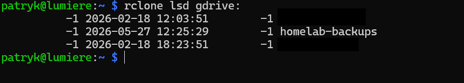
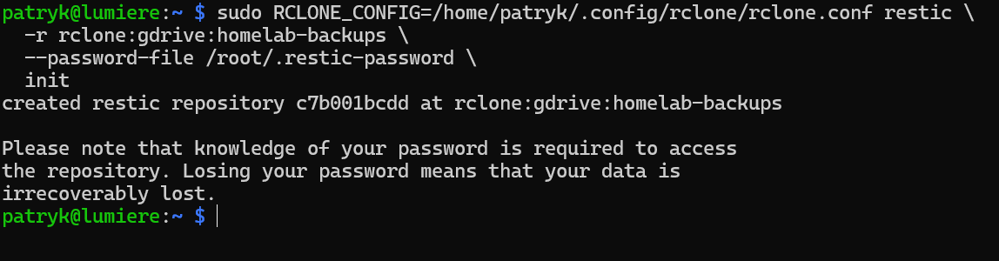
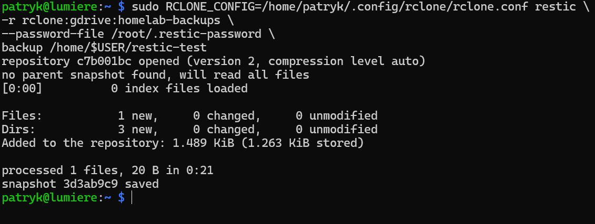
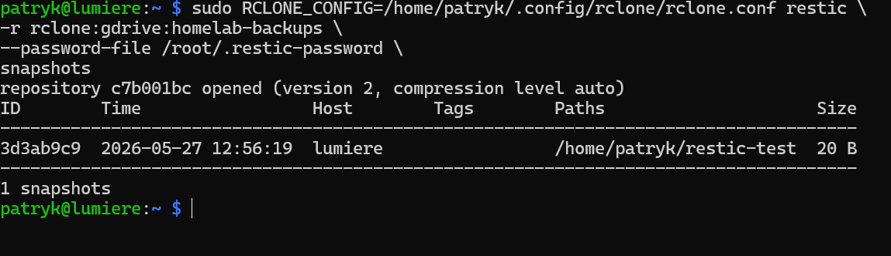
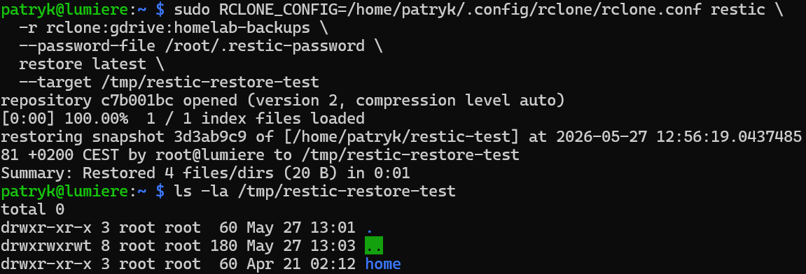
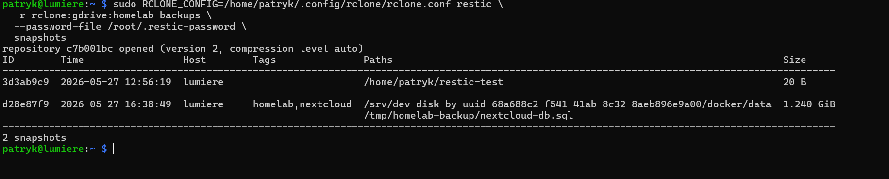

# Backup i odtwarzanie z Restic oraz rclone  
  
W kolejnym etapie projektu przygotowuję backup danych usług działających w homelabie.  
  
Po uruchomieniu Nextcloud, AdGuard Home, Nginx Proxy Managera, Prometheusa, Grafany i Uptime Kuma ważne stało się nie tylko to, żeby usługi działały, ale również to, żeby można było odtworzyć dane po awarii.  
  
Do backupu wykorzystuję:  
  
- **Restic** — tworzenie szyfrowanych snapshotów,  
- **rclone** — dostęp do zewnętrznej chmury,  
- **systemd timer** — automatyczne uruchamianie backupu,  
- **Ansible** — późniejsza automatyzacja wdrożenia backupu.  
  
Schemat działania:  
  
```
Restic → rclone → chmura
```

Na tym etapie backup zapisuję poza Raspberry Pi, w chmurze. Dzięki temu kopia danych nie znajduje się wyłącznie na tym samym urządzeniu, na którym działają usługi.

## Dlaczego Restic?

Restic pasuje do tego projektu, ponieważ:

- działa z poziomu CLI,
- tworzy szyfrowane backupy,
- obsługuje snapshoty,
- wspiera deduplikację danych,
- dobrze nadaje się do automatyzacji,
- można go połączyć z rclone i zapisywać backupy w chmurze.

W tym homelabie Restic będzie backupował:

- dane Nextcloud,
- dump bazy MariaDB dla Nextcloud,
- konfigurację AdGuard Home,
- konfigurację Nginx Proxy Manager,
- dane Grafany i Prometheusa,
- dane Uptime Kuma,
- wybrane pliki konfiguracyjne.

## Krok 1: Instalacja Restic i rclone

Na Raspberry Pi zainstalowałem Restic i rclone:

```
sudo apt update
sudo apt install restic rclone -y
```

Po instalacji sprawdziłem wersje:

```
restic version
rclone version
```

## Krok 2: Konfiguracja rclone

Rclone służy jako warstwa pośrednia między Restic a chmurą.

Konfigurację rozpocząłem poleceniem:

```
rclone config
```

Następnie utworzyłem nowy remote:

```
n) New remote
```

Jako nazwę remote podałem:

```
gdrive
```

Następnie wybrałem Google Drive jako backend i przeszedłem przez proces autoryzacji konta.

Po zakończeniu konfiguracji sprawdziłem połączenie:

```
rclone lsd gdrive:
```

Jeżeli polecenie zwraca katalogi albo nie pokazuje błędu, oznacza to, że rclone poprawnie łączy się z Google Drive.

## Krok 3: Katalog backupów w chmurze

Na potrzeby homelaba utworzyłem katalog backupowy w Google Drive:

```
rclone mkdir gdrive:homelab-backups
```

Następnie sprawdziłem, czy katalog istnieje:

```
rclone lsd gdrive:
```

Docelowe repozytorium Restic będzie miało postać:

```
rclone:gdrive:homelab-backups
```



## Krok 4: Hasło do repozytorium Restic

Restic szyfruje dane, dlatego wymaga hasła do repozytorium.

Hasła nie zapisuję w repozytorium GitHub.

Na Raspberry Pi utworzyłem plik:

```
sudo nano /root/.restic-password
```

W pliku zapisałem silne hasło do repozytorium Restic.

Następnie ustawiłem odpowiednie uprawnienia:

```
sudo chmod 600 /root/.restic-password  
sudo chown root:root /root/.restic-password
```

## Krok 5: Inicjalizacja repozytorium Restic w chmurze

Po skonfigurowaniu rclone i przygotowaniu hasła zainicjalizowałem repozytorium Restic:

```
sudo RCLONE_CONFIG=/home/patryk/.config/rclone/rclone.conf restic \
  -r rclone:gdrive:homelab-backups \
  --password-file /root/.restic-password \
  init
```



Po inicjalizacji można sprawdzić snapshoty:

```
sudo RCLONE_CONFIG=/home/patryk/.config/rclone/rclone.conf restic \
  -r rclone:gdrive:homelab-backups \
  --password-file /root/.restic-password \
  snapshots
```

Na początku lista snapshotów będzie pusta.

## Krok 6: Testowy backup małego katalogu

Zanim obejmę backupem dane usług, wykonałem prosty test na małym katalogu.

Utworzyłem katalog testowy:

```
mkdir -p ~/restic-test
echo "test backupu restic" > ~/restic-test/test.txt
```

Następnie wykonałem backup:

```
sudo RCLONE_CONFIG=/home/patryk/.config/rclone/rclone.conf restic \
-r rclone:gdrive:homelab-backups \
--password-file /root/.restic-password \
backup /home/$USER/restic-test
```



Po wykonaniu backupu sprawdziłem snapshoty:

```
sudo RCLONE_CONFIG=/home/patryk/.config/rclone/rclone.conf restic \
-r rclone:gdrive:homelab-backups \
--password-file /root/.restic-password \
snapshots
```

Jeżeli snapshot pojawia się na liście, backup działa poprawnie.



## Krok 7: Test odtwarzania

Backup ma sens dopiero wtedy, gdy można go odtworzyć.

Dlatego wykonałem test restore do katalogu tymczasowego:

```
sudo mkdir -p /tmp/restic-restore-test
```

Następnie odtworzyłem najnowszy snapshot:

```
sudo RCLONE_CONFIG=/home/patryk/.config/rclone/rclone.conf restic \
  -r rclone:gdrive:homelab-backups \
  --password-file /root/.restic-password \
  restore latest \
  --target /tmp/restic-restore-test
```

Po odtworzeniu sprawdziłem zawartość:

```
ls -la /tmp/restic-restore-test
```



Dopiero po takim teście można przejść do backupu właściwych danych homelaba.

## Krok 8: Zakres backupu danych usług

Po wykonaniu testowego backupu i sprawdzeniu odtwarzania określiłem zakres właściwego backupu homelaba.  
  
Początkowo rozważałem backupowanie wybranych katalogów usług osobno, np.:  
  
```
nextcloud  
adguard-home  
nginx-proxy-manager  
monitoring  
uptime-kuma
```

Finalnie zdecydowałem się backupować cały katalog:

```
/srv/dev-disk-by-uuid-CHANGE_ME/docker/data
```

Ten katalog zawiera dane usług uruchamianych w kontenerach, między innymi:

```
Nextcloud
AdGuard Home
Nginx Proxy Manager
Prometheus / Grafana
Uptime Kuma
```

Takie podejście jest prostsze i mniej podatne na pomyłki. Jeżeli w przyszłości dodam kolejną usługę i jej dane również będą trafiały do katalogu `docker/data`, nie będę musiał za każdym razem dopisywać jej ręcznie do skryptu backupowego.

W przypadku Nextcloud sam backup katalogu `docker/data` nie jest jednak wystarczający. Nextcloud korzysta z bazy MariaDB, dlatego przed wykonaniem backupu przygotowuję dodatkowo dump bazy danych.

Docelowy zakres backupu wygląda więc tak:

```
docker/data
+
dump bazy MariaDB dla Nextcloud
```

Dzięki temu backup obejmuje zarówno dane usług, jak i spójną kopię bazy danych Nextcloud.

## Krok 9: Backup Nextcloud i danych usług  
  
Nextcloud wymaga szczególnego podejścia do backupu, ponieważ korzysta z bazy MariaDB.  
  
Samo backupowanie katalogu `docker/data` jest wygodne, ale nie daje pełnej pewności spójności bazy danych, jeżeli MariaDB działa w trakcie wykonywania kopii. Dlatego przed wykonaniem backupu Restic przygotowuję osobny dump bazy danych Nextcloud.  
  
Przed backupem tworzę katalog tymczasowy:  
  
```
sudo mkdir -p /tmp/homelab-backup
```

### Przygotowanie pliku `.env` z danymi bazy  
  
Hasło do bazy danych nie powinno być wpisywane bezpośrednio w komendzie ani w skrypcie backupowym.  
  
Dlatego przygotowałem lokalny plik `.env`, który przechowuje dane potrzebne do wykonania dumpa bazy MariaDB dla Nextcloud.  
  
Plik utworzyłem na Raspberry Pi i umieściłem w nim hasła:  
  
```
sudo mkdir -p /opt/homelab-backup
sudo mcedit /opt/homelab-backup/.env
```

Format pliku .env
```
NEXTCLOUD_DB_CONTAINER=nextcloud-db  
NEXTCLOUD_DB_NAME=nextcloud  
NEXTCLOUD_DB_USER=nextcloud  
NEXTCLOUD_DB_PASSWORD=password
```

Następnie ustawiłem bezpieczne uprawnienia:

```
sudo chown root:root /opt/homelab-backup/.env
sudo chmod 600 /opt/homelab-backup/.env
```

Dzięki temu plik z hasłem jest dostępny tylko dla roota

Następnie wykonuję dump bazy MariaDB z kontenera Nextcloud:

```
sudo bash -c 'source /opt/homelab-backup/.env && docker exec "$NEXTCLOUD_DB_CONTAINER" mariadb-dump -u "$NEXTCLOUD_DB_USER" -p"$NEXTCLOUD_DB_PASSWORD" "$NEXTCLOUD_DB_NAME" > /tmp/homelab-backup/nextcloud-db.sql'
```

Po wykonaniu dumpa uruchamiam backup Restic, obejmując zarówno cały katalog `docker/data`, jak i plik z dumpem bazy:

```
sudo RCLONE_CONFIG=/home/patryk/.config/rclone/rclone.conf restic \
  -r rclone:gdrive:homelab-backups \
  --password-file /root/.restic-password \
  backup \
  /srv/dev-disk-by-uuid-CHANGE_ME/docker/data \
  /tmp/homelab-backup/nextcloud-db.sql \
  --tag homelab \
  --tag nextcloud
```

Po backupie sprawdzam listę snapshotów:

```
sudo RCLONE_CONFIG=/home/patryk/.config/rclone/rclone.conf restic \
  -r rclone:gdrive:homelab-backups \
  --password-file /root/.restic-password \
  snapshots
```




Na końcu usuwam tymczasowy plik dumpa:

```
sudo rm -f /tmp/homelab-backup/nextcloud-db.sql
```

Docelowy schemat backupu wygląda więc tak:

```
MariaDB dump
      +
docker/data
      ↓
Restic
      ↓
rclone
      ↓
Google Drive
```

Takie podejście daje prosty i praktyczny backup całego środowiska kontenerowego, a jednocześnie uwzględnia specyfikę Nextcloud i jego bazy danych.

## Krok 10: Test odtwarzania backupu  
  
Po wykonaniu backupu przygotowałem test odtwarzania danych do osobnego katalogu. Nie przywracałem danych bezpośrednio do katalogów produkcyjnych, żeby nie naruszyć działającego środowiska.  
  
Najpierw utworzyłem katalog testowy:  
  
```
sudo mkdir -p /tmp/restic-restore-test
```

Następnie odtworzyłem najnowszy snapshot:

```
sudo RCLONE_CONFIG=/home/patryk/.config/rclone/rclone.conf restic \
  -r rclone:gdrive:homelab-backups \
  --password-file /root/.restic-password \
  restore latest \
  --target /tmp/restic-restore-test
```

Po zakończeniu sprawdziłem zawartość katalogu:

```
sudo ls -la /tmp/restic-restore-test
```

Restic odtwarza dane razem z pełną strukturą oryginalnych ścieżek. Ponieważ backup obejmował katalog `docker/data`, odtworzone dane znajdują się w strukturze:

```
/tmp/restic-restore-test/srv/dev-disk-by-uuid-CHANGE_ME/docker/data
```

Dodatkowo sprawdziłem, czy odtworzony został dump bazy MariaDB dla Nextcloud:

```
sudo find /tmp/restic-restore-test -name "nextcloud-db.sql"
```

Ten test potwierdził, że backup nie tylko został wykonany, ale można go również odtworzyć do osobnej lokalizacji.

## Krok 11: Skrypt backupowy
Po wykonaniu testów ręcznych przygotowałem skrypt backupowy, który automatyzuje cały proces.

Skrypt znajduje się na Raspberry Pi w lokalizacji:

```
/opt/homelab-backup/backup-homelab.sh
```

Zawartość skryptu możesz znaleźć poniżej

[Backup script](../backup/scripts/backup-homelab.sh)

Skrypt odpowiada za:
1. wczytanie zmiennych z pliku .env,  
2. utworzenie dumpa bazy MariaDB dla Nextcloud,  
3. wykonanie backupu katalogu docker/data,  
4. dodanie dumpa bazy do backupu,  
5. zapisanie snapshotu w repozytorium Restic w Google Drive,  
6. dodanie tagów do snapshotu,  
7. wykonanie retencji snapshotów,  
8. zapisanie logów,  
9. usunięcie tymczasowego pliku dumpa bazy.

Na początku utworzyłem skrypt backupowy i nadałem mu odpowiednie uprawnienia
```
sudo touch /opt/homelab-backup/backup-homelab.sh
sudo chown root:root /opt/homelab-backup/backup-homelab.sh
sudo chmod 750 /opt/homelab-backup/backup-homelab.sh
```

W skrypcie trzeba podmienić:

```
CHANGE_ME
```

na właściwy identyfikator dysku widoczny w OpenMediaVault.

Następnie uruchomiłem go ręcznie:

```
sudo /opt/homelab-backup/backup-homelab.sh
```

Po zakończeniu sprawdziłem snapshoty:

```
sudo RCLONE_CONFIG=/home/patryk/.config/rclone/rclone.conf restic \
  -r rclone:gdrive:homelab-backups \
  --password-file /root/.restic-password \
  snapshots
```

Dzięki temu upewniłem się, że skrypt tworzy backup poprawnie, zanim dodałem automatyczne uruchamianie przez `systemd timer`.

## Krok 12: Automatyzacja przez systemd timer

Po przygotowaniu i ręcznym przetestowaniu skryptu backupowego dodałem automatyczne uruchamianie backupu przez `systemd timer`.

Zamiast używać klasycznego `cron`, wybrałem `systemd timer`, ponieważ jest dobrze zintegrowany z systemem, pozwala łatwo sprawdzać status uruchomień i może wykonać pominięte zadanie po restarcie systemu dzięki opcji `Persistent=true`.

Utworzyłem dwa pliki 
```
sudo touch /etc/systemd/system/restic-backup.service
sudo touch /etc/systemd/system/restic-backup.timer
```

Zawartość tych plików umieściłem w repozytorium, poniżej linki:
[Restic backup service](../backup/systemd/restic-backup.service)

[Restic backup timer](../backup/systemd/restic-backup.timer)

Timer uruchamia backup codziennie o godzinie 03:00.

Po dodaniu zawartości do plików, przeładowałem konfiguracje systemd:

```
sudo systemctl daemon-reload
```

Następnie włączyłem i uruchomiłem timer:

```
sudo systemctl enable --now restic-backup.timer
```

Status timera można sprawdzić poleceniem:

```
systemctl list-timers | grep restic
```

Szczegóły timera:

```
systemctl status restic-backup.timer
```

Ręczne uruchomienie backupu przez usługę:

```
sudo systemctl start restic-backup.service
```

Logi z uruchomienia usługi można sprawdzić przez:

```
journalctl -u restic-backup.service -n 50
```

Dodatkowo skrypt zapisuje własny log w pliku:

```
/var/log/homelab-restic-backup.log
```

Można go podejrzeć poleceniem:

```
sudo tail -n 50 /var/log/homelab-restic-backup.log
```

## Podsumowanie

Restic i rclone dodają do projektu warstwę backupu poza Raspberry Pi.

Dzięki temu dane usług nie są przechowywane wyłącznie lokalnie. W razie awarii Raspberry Pi albo dysków można odtworzyć dane z repozytorium backupów w chmurze.

Kolejnym krokiem jest automatyzacja wdrożenia tej konfiguracji z wykorzystaniem Ansible.
